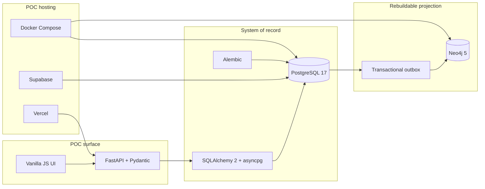

# Omobio Intelligence POC

Shared intelligence across Omobio applications: **PostgreSQL** is the system of record, **Neo4j** is a rebuildable relationship projection, and digital twins are computed from facts, inference, and predictions.

<p align="center">
  
  
  
  
</p>
<p align="center">
  
  
  
  
</p>
<p align="center">
  
  
  
  
  
</p>

> Architecture is **locked**. Do not invert the stack (predictions are not graph facts; Cypher stays out of domain services). See [docs/LOCKED-ARCHITECTURE.md](docs/LOCKED-ARCHITECTURE.md).


## Technologies



| Layer | Stack |
|---|---|
| Language | Python 3.12, Poetry |
| API & validation | FastAPI, Pydantic, Uvicorn |
| Source of truth | PostgreSQL 17, SQLAlchemy 2 (async), asyncpg, Alembic |
| Graph projection | Neo4j 5, official Neo4j driver, outbox worker |
| Hosted POC | Supabase (Postgres), Neo4j Aura, Vercel (one origin for UI + API) |
| Local runtime | Docker Compose |
| Quality | pytest, Ruff |
| Intelligence (later) | scikit-learn, pandas — derived, never authoritative |

## What this POC proves

Omobio applications (Selfcare, Loyalty, adReach, Viber, Mobile Money, SFA) can contribute events to **one shared intelligence layer** instead of each keeping isolated AI.

- Facts and history live in PostgreSQL.
- Relationships are projected into Neo4j and can be rebuilt from Postgres.
- Temporal queries use `as_of` / event history; state is reconstructed from facts.
- The current live slice is a **capability-00 read-only showcase**, not a complete FastAPI or simulator product.

## Layout

```text
src/telco_digital/
  domain/            entities, rules (no SQL, no Cypher)
  application/       commands, queries, services
  infrastructure/
    postgres/        SQLAlchemy, repositories, UoW
    neo4j/           projector, Cypher
    workers/         outbox → graph
  api/               FastAPI adapters
frontend/            framework-free Intelligence Showcase UI
alembic/             schema migrations
docs/                locked architecture and capability evidence
```

Business logic lives in `application` and `domain`. SQL stays in PostgreSQL repositories. Cypher stays in the Neo4j infrastructure package.

## Local

```bash
docker compose up -d
cp .env.example .env
poetry install --extras "dev"
poetry run alembic upgrade head
poetry run python scripts/seed_demo_data.py
poetry run uvicorn telco_digital.api.app:app --reload
poetry run pytest
```

Open [http://127.0.0.1:8000](http://127.0.0.1:8000). Set `SHOWCASE_ENABLED=true` in `.env`.

If Docker is not running, `pytest` still covers the temporal core against an in-memory unit of work.

## Vercel POC

One Vercel project serves the UI and FastAPI on the same origin (`/` and `/api/v1/...`).

- **Runtime:** Supabase **transaction pooler** (`:6543`) and `DATABASE_POOL_MODE=transaction`
- **Migrations:** Supabase **direct** connection (`:5432`) from a trusted machine, not during function startup

See [docs/VERCEL-DEPLOYMENT.md](docs/VERCEL-DEPLOYMENT.md) and [docs/CONNECTION.md](docs/CONNECTION.md).

## Docs

| Document | Contents |
|---|---|
| [LOCKED-ARCHITECTURE.md](docs/LOCKED-ARCHITECTURE.md) | Stack, write path, hard rules |
| [SHARED-INTELLIGENCE.md](docs/SHARED-INTELLIGENCE.md) | Cross-app intelligence framing |
| [DATA-MODEL.md](docs/DATA-MODEL.md) | Postgres schemas, outbox, Neo4j projection |
| [POC-UI.md](docs/POC-UI.md) | Intelligence Showcase UI |
| [CONNECTION.md](docs/CONNECTION.md) | Local, Supabase, Aura |
| [VERCEL-DEPLOYMENT.md](docs/VERCEL-DEPLOYMENT.md) | Single-project deploy |
| [MILESTONES.md](docs/MILESTONES.md) | Milestone 1–15 gates |
