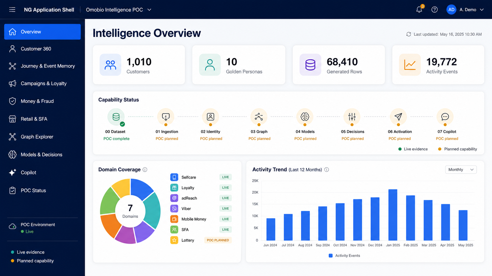
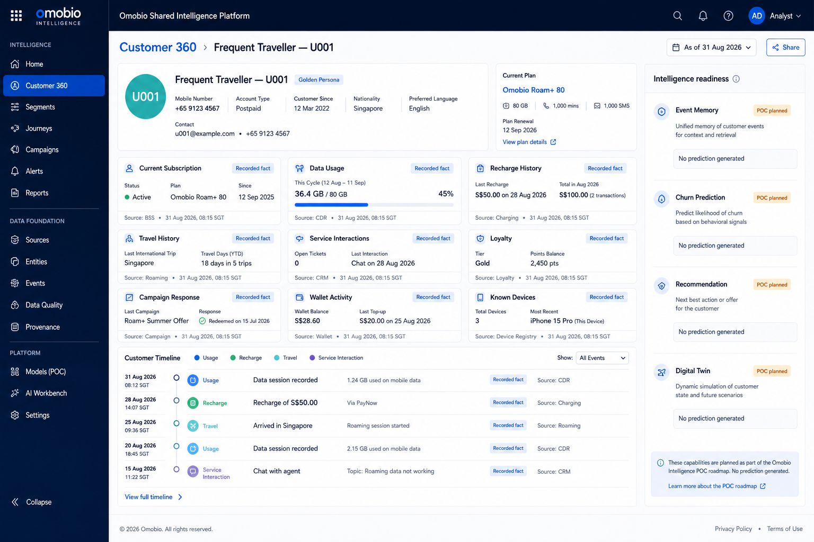
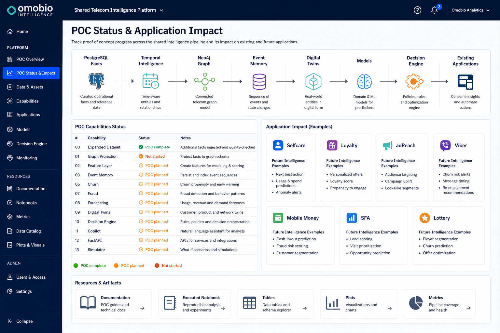

# POC Intelligence Showcase UI

## Purpose

The POC UI should help a visitor understand what the shared-intelligence platform
does in a few minutes. It is not a replacement for Omobio's existing products.
It is an **Intelligence Showcase** that demonstrates how one shared data and
decision layer can make the existing applications smarter.

The showcase must distinguish three states:

| Label | Meaning |
|---|---|
| **Live POC** | Implemented, executed and verified in this repository |
| **POC planned** | Part of the accepted capability sequence but not implemented yet |
| **Production future** | Required for a real deployment but deliberately outside this POC |

The current live capability is the expanded cross-application dataset described
in [features/00-poc-dataset.md](./features/00-poc-dataset.md). The authoritative
implementation status is maintained in [features/README.md](./features/README.md).

## Visual concepts

These generated concept images communicate the intended POC experience. They
are design references, not screenshots of an implemented frontend. Any values
other than the verified capability-00 summary counts are illustrative UI copy.

### Intelligence overview



The landing page summarizes verified dataset evidence, application coverage and
capability status without presenting planned models as live.

### Customer 360



The Customer 360 view leads with recorded facts and provenance. Future event
memory, churn, recommendations and digital-twin panels remain explicitly marked
as planned until their capabilities are verified.

### POC status and application impact



The status view connects the shared platform to Selfcare, Loyalty, adReach,
Viber, Mobile Money, SFA and Lottery while linking stakeholders to implementation
evidence such as documentation, notebooks, tables, plots and metrics.

## Product position

The UI should appear inside the existing Omobio/NG application shell as a new
top-level **Intelligence** workspace. Existing applications remain the places
where operational users work:

```text
Existing Omobio applications
  Selfcare | Loyalty | adReach | Viber | Mobile Money | SFA | Lottery
                              |
                              v
                  Shared Intelligence workspace
                              |
             facts -> context -> insight -> decision
```

The relationship between capabilities and existing applications is detailed in
[EXISTING-APP.md](./EXISTING-APP.md).

## Primary navigation

```text
Intelligence
  Overview
  Customer 360
  Journey and Event Memory
  Campaigns and Loyalty
  Money and Fraud
  Retail and SFA
  Graph Explorer
  Models and Decisions
  Copilot
  POC Status
```

Unavailable pages remain visible with a **POC planned** badge and a short
description. They must not display fabricated metrics or simulated model output
as though it were implemented.

## 1. Overview

The landing page tells the complete POC story without requiring technical
knowledge.

### Summary cards

Show live values from capability 00:

- 1,010 customers in the shared POC database.
- 1,000 generated background customers.
- 10 golden personas across existing and newly generated fixtures.
- 68,410 deterministic cross-domain generated rows.
- 19,772 activity events with 19,772 matching outbox events.
- Twelve months of generated history.

Each card should include its source and an `as_of` timestamp. Counts must come
from a backend read service; they must not be hard-coded into the final UI.

### Domain coverage

Use a compact domain matrix:

| Domain | Demonstrated data | Existing application connection |
|---|---|---|
| Telco | Plans, subscriptions, usage, recharge, travel, service interactions | Selfcare |
| Marketing | Campaigns and responses | adReach, Viber |
| Loyalty | Accounts and point ledger | Loyalty Management |
| Money | Wallets, merchants and transactions | Mobile Money |
| Sales | Distributors, retailers, agents, products, sales and inventory events | SFA |
| Shared activity | Immutable activity history and transactional outbox | All applications |

### Visual evidence

Display the retained capability-00 plots:

- Generated rows by table.
- Persona distribution.
- Twelve-month activity trends.

The UI may serve these retained POC assets initially. A later implementation
should obtain refreshed values from API endpoints.

## 2. Customer 360

This page demonstrates how data from existing applications becomes one customer
view. The first version should provide:

- Persona selector, including golden scenarios.
- Explicit `as_of` date and time.
- Current subscription and plan.
- Usage and recharge timeline.
- Travel and service interaction history.
- Campaign response and loyalty history.
- Wallet activity and known devices.
- Data provenance for every section.

Until temporal features and digital twins are implemented, this page must show
only recorded facts. Derived traits, predictions and recommendations appear as
**POC planned**, not as empty or invented values.

## 3. Existing-application lenses

The same shared data should be presented through application-specific lenses.

### Mobile Selfcare

Show plan, usage, recharge, travel and service history. Later capabilities add
event-memory-based roaming guidance, churn-aware service actions and next-best
offers.

### Loyalty Management

Show loyalty balance reconstruction, point-ledger history and campaign response.
Later capabilities add behaviour traits, reward ranking and retention actions.

### adReach and Viber

Show campaign exposure, response and conversion history. Later capabilities add
audience intelligence, campaign fatigue, propensity and channel selection.

### Mobile Money

Show wallet, merchant, transaction and device facts. Later capabilities add
graph evidence, fraud scoring and review recommendations.

### Mobile SFA

Show distributors, retailers, agents, product sales and inventory events. Later
capabilities add demand forecasts, retailer twins, stockout warnings and visit
priorities.

### Mobile Lottery

Keep this as a secondary lens. Later graph and anomaly capabilities may support
abuse investigation and responsible monitoring.

## 4. Golden-scenario walkthrough

The UI should offer guided demonstrations rather than forcing visitors to find
meaningful records manually.

| Scenario | Existing application | Current evidence | Later intelligence |
|---|---|---|---|
| Customer travels to Singapore | Selfcare | Travel, plan and usage facts | Event memory and uncertainty-aware recommendation |
| Repeated small recharges | Selfcare, Loyalty | Recharge and balance history | Behaviour trait and personalised offer |
| Falling usage with complaints | Selfcare, Loyalty, adReach/Viber | Usage and service events | Churn risk and next-best action |
| Shared device and suspicious transfers | Mobile Money | Device, wallet, merchant and transaction facts | Neo4j graph fraud evidence |
| Falling retailer stock with rising sales | SFA | Sales and inventory events | Forecast, retailer twin and restock action |
| Changing campaign responses | adReach, Viber | Campaign interaction history | Campaign intelligence and channel decision |

Each walkthrough should use the same presentation order:

1. What happened — authoritative facts.
2. What the platform knows — reconstructed context.
3. What it infers or predicts — derived output with version and confidence.
4. What it recommends — decision plus reason codes.
5. What remains unknown — missing evidence and uncertainty.
6. Which existing Omobio application consumes the result.

## 5. Visual language and trust

All future pages must visually distinguish information types:

| Type | Suggested treatment | Rule |
|---|---|---|
| Fact | Blue, `Recorded fact` badge | Comes from PostgreSQL history |
| Relationship | Purple, `Graph projection` badge | Rebuildable from PostgreSQL |
| Inference | Amber, `Derived` badge | Includes feature or rule version |
| Prediction | Orange, `Prediction` badge | Includes model version and confidence |
| Recommendation | Green, `Recommended action` badge | Includes constraints and reason codes |
| Unknown | Grey, `Unknown` badge | Must remain explicit |
| Warning | Red, `Review required` badge | Must show supporting evidence |

Never present a prediction as a fact or hide missing information. Every derived
panel must display `as_of`, provenance and version metadata.

## 6. POC status page

This page mirrors [features/README.md](./features/README.md) and provides links
to the feature documents, notebooks, metrics, tables and plots. For each
capability it shows:

- Status: Not started, In progress, POC complete or Deferred.
- Demonstrated scenario.
- Existing applications that consume it.
- Verification evidence.
- What is implemented.
- What is not implemented.
- POC limitations.

This page prevents scaffold code or future designs from being mistaken for
working functionality.

## 7. Technical integration

### Frontend stack

The POC frontend will use framework-free web technologies:

- Semantic HTML for page structure.
- Plain CSS with shared variables and reusable component classes.
- Plain JavaScript using ES modules.
- The browser `fetch` API for FastAPI requests.
- Chart.js for the small number of interactive charts.

The frontend keeps the visual language of the existing Omobio/NG application
shell, but it does not require Angular or another frontend framework. This keeps
the POC easy to build, inspect, deploy and hand over.

The intended structure is:

```text
frontend/
  index.html
  css/
    variables.css
    layout.css
    components.css
  js/
    config.js
    api.js
    app.js
    charts.js
    customer-360.js
    simulator.js
  assets/
```

Runtime configuration such as the public FastAPI base URL must be isolated in
`config.js` or injected during deployment. Database, Neo4j and OpenRouter
credentials must never be included in frontend files.

The browser must not connect directly to Supabase internal schemas or Neo4j.
When capability 12 is reached, the framework-free frontend will call thin
FastAPI endpoints:

```text
HTML / CSS / JavaScript frontend
        |
        v
FastAPI read and command adapters
        |
        v
Application services and SQLAlchemy transaction boundary
        |
        +--> PostgreSQL / Supabase (source of truth)
        |
        +--> Neo4j (read-only rebuildable projection)
```

Writes must preserve the locked path:

```text
UI command -> FastAPI -> application service -> SQLAlchemy transaction
           -> domain fact + activity event + outbox event
```

FastAPI routes must not contain business rules, SQL, Cypher or model training.
Neo4j must never receive arbitrary direct writes from the UI.

### POC deployment

The frontend and FastAPI backend are packaged as one Vercel project and share a
single origin. Supabase continues to host PostgreSQL and Neo4j Aura hosts the
graph projection:

```text
One Vercel FastAPI project
  +--> /            HTML / CSS / JavaScript
  +--> /api/v1/*    FastAPI
                         |
                         +--> Supabase PostgreSQL
                         +--> Neo4j Aura
```

The root `app.py` is Vercel's entrypoint. FastAPI serves the existing
`frontend/` directory, so `API_BASE_URL=/api/v1` remains same-origin and CORS is
not required for the deployed UI. See
[VERCEL-DEPLOYMENT.md](./VERCEL-DEPLOYMENT.md) for environment and migration
instructions.

## 8. Delivery sequence

UI work follows the capability order rather than getting ahead of verified
backend behaviour:

1. Now: retain this UI specification and expose capability-00 evidence in docs.
2. Capabilities 01–10: add verified graph, feature, memory, model, twin and
   decision outputs to their relevant page contracts.
3. Capability 11: add a read-only grounded Copilot with deterministic fallback.
4. Capability 12: implement the thin FastAPI boundary.
5. Capability 13: implement the framework-free POC simulator using the existing
   NG application's visual language.

## What is available now

- Cross-domain, deterministic POC data in Supabase PostgreSQL.
- Golden personas and twelve months of historical facts.
- Idempotent dataset loading and validation.
- Executed capability-00 notebook, metrics, compact tables and plots.
- Documentation showing how the shared layer connects to existing applications.
- An early **read-only HTML/CSS/JavaScript showcase** for capability-00
  evidence, documented in [features/00-read-only-showcase.md](./features/00-read-only-showcase.md).
  Live pages call a minimal FastAPI read slice. Capabilities 12 and 13 remain
  not started.

## What is not implemented now

- The complete FastAPI capability (all application services, projection lag,
  model versions) and the POC simulator / write path.
- Authentication, roles, permissions or multi-tenant UI isolation.
- Live Neo4j projection for the expanded dataset.
- Feature, event-memory, model, recommendation, twin or decision screens.
- Copilot interaction.
- Production UX, accessibility validation, telemetry or operational support.

## POC limitations

The proposed UI demonstrates the shared-intelligence concept. It does not imply
production scalability, enterprise security certification, high availability,
complete observability, production model accuracy, production UI quality or
approval of the representative business policies.
