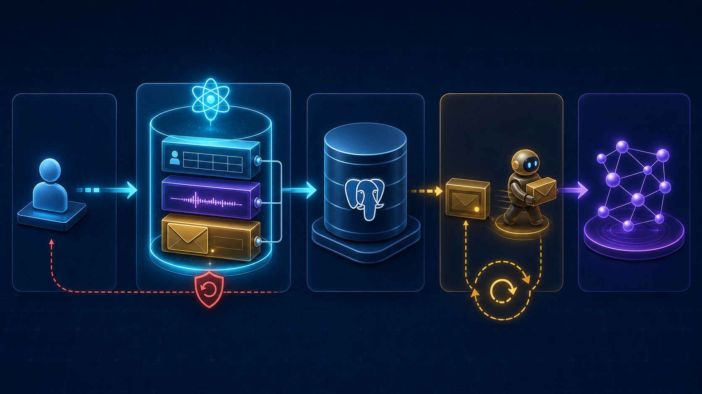
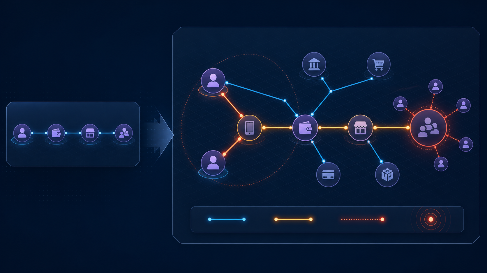

# Telco Digital — Technical Interview Presentation

Audience: software, data, ML, and solution-architecture interviewers.

Recommended duration: 10–12 minutes, followed by a technical deep dive.

Presentation objective: explain what I built, why the data architecture matters, how the capabilities build on each other, and which engineering decisions I can defend.

## Slide 1 — What I built

### Slide title

From operational events to explainable decisions

### Subtitle

An end-to-end shared-intelligence POC for telecom customers, fraud, recommendations, and retail forecasting.

### On-slide content

I built the complete technical path:

`Data foundation → Temporal and graph context → Intelligence → Governed decisions → API and UI`

Capability summary:

- PostgreSQL data model, ledgers, events, and transactional outbox
- Neo4j relationship projection and graph exploration
- Temporal and graph feature services
- Event memory, behaviour, churn, and recommendations
- Graph fraud and SFA forecasting
- Digital twins, decisioning, explanations, and Copilot
- FastAPI routes, showcase UI, notebooks, and automated tests

### Visual layout

- Large title on the left.
- Five-stage capability chain across the lower third.
- Small callout: `Capabilities 00–12: POC complete`.
- Small honest-status callout: `Interactive simulator: not started`.

### What I should say

> “I did not build only one ML model. I built the data and service architecture needed to make several intelligence capabilities reproducible, explainable, and reusable.”

---

## Slide 2 — How all capabilities fit together

### Slide title

One platform, multiple intelligence capabilities

### Main message

The system was built bottom-up. Each capability consumes stable contracts from the layer below instead of reading arbitrary tables or embedding logic in API routes.

### Generated architecture visual


### Editable labels to place over or beneath the image

1. Operational signals
2. PostgreSQL facts
3. Temporal state and features
4. Neo4j relationship context
5. Intelligence capabilities
6. Digital twin
7. Decision and explanation
8. API, UI, and Copilot

### Capability sequence

| Foundation | Intelligence | Action and delivery |
|---|---|---|
| 00 Dataset | 03 Event memory | 09 Digital twins |
| 01 Neo4j projection | 04 Behaviour | 10 Decision engine |
| 02 Feature layer | 05 Churn | 11 Copilot |
|  | 06 Recommendations | 12 FastAPI |
|  | 07 Graph fraud |  |
|  | 08 SFA forecasting |  |

### What I should say

> “The dependency direction is intentional: facts first, derived context second, predictions third, and business decisions last.”

### Interview point

This structure prevents ML, SQL, Cypher, business rules, and presentation logic from being mixed together.

---

## Slide 3 — Data layer: PostgreSQL is the source of truth

### Slide title

The data model separates facts, history, integration, and intelligence

### Main message

PostgreSQL owns authoritative state and transactional history. Derived intelligence is versioned separately so it can be explained and recomputed.

### Schema map

| Schema | Responsibility | Examples |
|---|---|---|
| `core` | Stable identities and catalogue | Customer, account, SIM, device, plan, subscription |
| `telco` | Telecom activity | Recharge, usage, travel, service, balance ledger |
| `money` | Mobile-money activity | Wallet, merchant, transaction |
| `marketing` | Customer engagement | Loyalty ledger, campaign interactions |
| `sfa` | Retail operations | Retailer, product, sales, inventory, promotion |
| `activity` | Immutable cross-domain history | Business events |
| `integration` | Reliable asynchronous delivery | Outbox events |
| `intelligence` | Derived, versioned outputs | Features, predictions, recommendations, warnings |

### Key engineering decisions

- Use ledgers for historical reconstruction; do not trust only a mutable balance.
- Store `occurred_at` and `recorded_at` to preserve event-time and ingestion-time semantics.
- Keep facts, features, inferences, predictions, decisions, and explanations separate.
- Treat a digital twin as computed context, not another authoritative customer table.

### Recommended visual layout

Use four stacked layers rather than showing every physical table:

1. Domain facts and ledgers
2. Immutable event history
3. Integration outbox
4. Derived intelligence records

### What I should say

> “For any prediction or recommendation, I wanted to be able to recover the original facts, the selected point in time, and the feature snapshot that produced it.”

---

## Slide 4 — Reliable writes and graph projection

### Slide title

One PostgreSQL transaction prevents dual-write inconsistency

### Main message

Every important command writes the business fact, activity event, and outbox event together. Neo4j is updated later by a retryable worker.

### Generated transactional-outbox visual



### Editable stage labels

1. API command
2. Atomic transaction
3. PostgreSQL commit
4. Outbox worker and retry
5. Neo4j projection

### Transaction contents

```text
BEGIN
  Write domain fact
  Append activity event
  Append outbox event
COMMIT
```

If any write fails, the transaction rolls back.

### Projection behaviour

- The worker claims pending outbox events.
- Graph writes use parameterized Cypher and idempotent `MERGE`.
- Processing is checkpointed only after projection succeeds.
- Managed graph data can be cleared and rebuilt from PostgreSQL.

### Trade-off to explain

The POC uses a controlled snapshot rebuild, which is simple and reliable but less efficient than production-scale change-level projection.

### What I should say

> “I avoided writing directly to PostgreSQL and Neo4j in one request because one database could succeed while the other fails. The outbox turns that into a retryable delivery problem.”

---

## Slide 5 — Temporal correctness before machine learning

### Slide title

Every calculation is bounded by `as_of`

### Main message

The platform can reconstruct customer state at any selected time and prevents future information from leaking into features or predictions.

### Three time concepts

| Field | Meaning |
|---|---|
| `occurred_at` | When the real-world activity happened |
| `recorded_at` | When the platform received it |
| `as_of` | Latest event time the calculation is allowed to use |

### Services I built

- `CustomerStateService`: observed state at a selected timestamp
- `TimelineService`: ordered customer activity history
- `TemporalFeatureService`: 30-day, 90-day, and previous-window features
- Deterministic warnings for known business patterns

### Demonstration scenario

```text
09:00 — Customer appears in Singapore
10:00 — Same customer appears in the USA
Result — Keep both events and emit IMPOSSIBLE_TRAVEL
```

### Why this matters

- Preserves contradictory evidence instead of deleting it.
- Enables historical reconstruction.
- Prevents future leakage during training and scoring.
- Makes earlier recommendations reproducible.

### Visual suggestion

A horizontal timeline with an `as_of` barrier. Events after the barrier should be visually faded and excluded from the feature window.

### What I should say

> “Before trusting a model, I proved that its input data was correct for the selected historical time. Otherwise, the evaluation could look good because it accidentally used the future.”

---

## Slide 6 — Why graphs add value

### Slide title

An isolated transaction can look normal; its relationships may not

### Main message

Neo4j is used only where traversal and multi-hop relationships provide information that direct relational facts do not express clearly.

### Generated graph-fraud visual



### Editable node labels

- Customer A
- Customer B
- Shared device
- Wallet
- Merchant
- Known fraud cluster

### Editable edge legend

- Cyan: observed relationship
- Amber: suspicious evidence path
- Coral: known or elevated-risk neighbourhood

### Graph use cases

- Shared devices and wallets
- Counterparty and merchant neighbourhoods
- Wallet funnels and circular transfers
- Proximity to known fraud within bounded hops
- Customer 360 relationship exploration
- Traversable evidence paths for explanations

### Graph guardrails

- PostgreSQL remains authoritative.
- The UI never writes directly to Neo4j.
- Predictions are not stored as graph facts.
- Missing graph evidence is `unknown`, not zero.

### What I should say

> “The strongest graph example is fraud. A transaction-only score can miss that a customer shares a device or wallet path with a suspicious cluster.”

---

## Slide 7 — Reusable feature layer and event memory

### Slide title

One feature contract supports multiple capabilities

### Main message

I created a versioned customer feature contract combining point-in-time relational evidence with bounded graph context.

### Feature flow

```text
PostgreSQL → TemporalFeatureService ┐
                                    ├→ CustomerFeatureService
Neo4j      → GraphFeatureService    ┘
```

### Feature contract

`CustomerFeatureService(customer_ref, as_of)` returns:

- Usage, recharge, money, plan, travel, service, loyalty, and campaign groups
- Relationship counts and graph risk context
- Availability, provenance, and unknown reasons
- Feature version `customer-features-v1`
- Deterministic UUID5 snapshot ID

### Event memory

Travel events become episodes containing destination, duration, usage, active plan, and outcome.

Retrieval priority:

1. Same customer, same situation
2. Same customer, similar situation
3. Similar customers
4. Population history

### Why this layer matters

Behaviour, churn, recommendations, fraud, and twins reuse the same point-in-time contracts instead of implementing separate feature queries.

### What I should say

> “The feature service is the reusable boundary between raw data and intelligence. Event memory adds previous experience, with personal history ranked before population assumptions.”

---

## Slide 8 — Intelligence capabilities built on the foundation

### Slide title

Different capabilities, consistent engineering contracts

### Main capability matrix

| Capability | Technical approach | Result |
|---|---|---|
| Behaviour | Evidence-backed deterministic traits; clustering analysed in notebooks | Traits, confidence, evidence |
| Churn | Logistic regression compared with boosted trees; lightweight artifact served | Probability, band, drivers, version |
| Recommendations | Catalogue-only candidates, event-memory scoring, uncertainty modes | Ranked offers without invented plans |
| Graph fraud | Transaction features + graph features + deterministic rules | Separate and combined risk evidence |
| SFA forecasting | Naive, moving-average, ARIMA, and Prophet comparison | Demand, stockout probability, action |

### Shared principles

- Every service receives an explicit `as_of`.
- Baselines are compared before selecting more complex models.
- Runtime services use versioned artifacts and typed outputs.
- Deterministic rules remain visible alongside probabilistic scores.
- Unknowns and uncertainty are returned to the caller.

### Honest limitation

The dataset is synthetic and scenario-shaped. POC metrics demonstrate the workflow, not real-world accuracy, calibration, fairness, or production scale.

### What I should say

> “The capabilities are different, but their engineering contract is consistent: bounded inputs, versioned outputs, explicit evidence, and no hidden business action.”

---

## Slide 9 — From predictions to governed action

### Slide title

The digital twin assembles context; the decision engine controls action

### Digital twin

A computed point-in-time view containing:

`Observed · Recent · Historical · Relationships · Inferred · Predicted · Unknown · Recommended · Warnings`

It is not another authoritative table.

### Decision engine

Combines recommendations, behaviour, and churn to produce:

- `PRESENT_OFFER`
- `SUPPORT_FOLLOW_UP`
- `REQUEST_INFORMATION`
- `NO_INVENTED_OFFER`

Every decision includes what, why, evidence, alternatives, confidence, and unknowns.

### Governance example

High churn can block an upsell or trigger support follow-up. It cannot invent a discount or product.

### Copilot boundary

```text
Structured decision
→ grounded context pack
→ optional language model
→ grounding validation
→ answer or deterministic fallback
```

The Copilot presents intelligence. It does not create facts, calculate risk, or execute commands.

### What I should say

> “A model estimates what may happen. The decision engine determines what the business should do under rules and uncertainty. Copilot only explains that structured result.”

---

## Slide 10 — Delivery, proof, and engineering lessons

### Slide title

The architecture is implemented as an end-to-end POC

### Delivered technical surface

- Typed FastAPI command and query routes
- SQLAlchemy async repositories and unit of work
- Alembic-managed PostgreSQL schema
- Real hosted PostgreSQL-compatible seeding
- Neo4j rebuild and projection worker
- Customer 360, Graph Explorer, Journey, fraud, forecasting, twin, and decision views
- Executed notebooks with tables, metrics, plots, and exported model artifacts
- Unit, integration, live, and scenario tests

### Existing visual evidence

Use these screenshots as a three-panel strip:

- `docs/assets/ui/01-intelligence-overview.png`
- `docs/assets/ui/02-customer-360.png`
- `docs/assets/ui/03-poc-status-application-impact.png`

### Engineering decisions I would defend

1. PostgreSQL as source of truth
2. Neo4j as a rebuildable projection
3. Transactional outbox instead of dual writes
4. `as_of` boundaries everywhere
5. Reusable feature contracts
6. Separate prediction and decision layers
7. LLM only after structured intelligence exists

### Honest production gaps

- Authentication and tenant isolation
- Distributed projection workers and dead-letter handling
- Load testing, monitoring, and SLAs
- Production training data, calibration, drift, and fairness processes
- Outcome feedback and human review workflows
- Interactive simulator UI

### Closing statement

> “The strongest part of my work is the technical chain connecting trustworthy data to explainable action. Each capability is useful independently, but together they form a reusable intelligence platform.”

---

# Interview discussion order

If the interviewer requests a deeper explanation, use this order:

1. PostgreSQL schemas, ledgers, and Unit of Work
2. Transactional outbox and recovery behaviour
3. `occurred_at`, `recorded_at`, and `as_of`
4. Neo4j projection and graph-fraud example
5. Feature snapshots and event memory
6. Model training versus runtime scoring
7. Recommendation uncertainty and catalogue safety
8. Digital twin and decision governance
9. FastAPI boundaries and testing strategy
10. Production improvements

# Visual style guidance

- Background: deep navy
- PostgreSQL and temporal facts: cyan
- Neo4j relationships: violet
- Derived intelligence and decisions: amber
- Risk warnings: restrained coral
- Titles: Poppins or Aptos Display
- Body: Lato or Aptos
- Keep generated visuals free of baked-in explanatory text.
- Add labels, legends, and arrows as editable PowerPoint elements.
- Avoid placing more than one major diagram and three short supporting points on the same slide.

# Generated image prompts

The generated assets were created with the built-in image-generation workflow.

## Capability architecture prompt

Conceptual 16:9 telecom shared-intelligence architecture: operational signals and relational databases flow into temporal context and a relationship graph, then multiple intelligence modules, a digital twin, governed decisioning, and an application surface. Dark navy, cyan, violet, and amber; enterprise technical infographic; no text or logos.

## Transactional outbox prompt

Conceptual 16:9 reliable write path: application command enters one atomic bundle containing a business fact, immutable activity event, and outbox event; the bundle commits to PostgreSQL; a retryable worker projects to a downstream graph. Dark technical enterprise infographic; no text.

## Graph-fraud prompt

Conceptual 16:9 relationship-risk comparison: an isolated transaction looks normal, but the expanded network reveals two customers sharing a device and a wallet/merchant path toward a suspicious cluster. Cyan facts, violet graph nodes, amber evidence paths, coral risk markers; no text.
