# Telco Digital — Technical Interview PPT Content v2

This version uses:

- Two dedicated slides for the data layer
- One slide for each capability from 00 through 11
- No FastAPI capability slide
- Existing notebook figures as technical evidence
- Existing generated architecture visuals and live UI screenshots

Total: 14 technical slides. An optional title slide may be added before Slide 1 and is not counted below.

## Optional cover — Telco Digital Shared Intelligence POC

### Title

Building trustworthy intelligence from operational telecom data

### Subtitle

PostgreSQL facts, temporal reconstruction, Neo4j relationships, ML capabilities, and explainable decisions

### Speaker opening

> “I built the complete chain from operational data to reusable intelligence. The key engineering challenge was not only creating models, but making every feature, prediction, and decision traceable to the correct facts and point in time.”

---

## Slide 1 — Data layer I: authoritative facts and domain separation

### Main message

PostgreSQL is the source of truth. The schema separates stable identities, operational facts, immutable history, integration events, and derived intelligence.

### Recommended layout

- Left 58%: generated architecture visual
- Right 42%: schema groups and design rules
- Bottom: one-line fact-to-decision taxonomy

### Visual


### Editable labels for the visual

`Operational signals → PostgreSQL facts → Temporal context → Graph context → Intelligence → Decisions`

### Schema groups

| Schema | Responsibility |
|---|---|
| `core` | Customer, account, SIM, device, plan, subscription |
| `telco` | Recharge, usage, travel, service, balance ledger |
| `money` | Wallet, merchant, transaction |
| `marketing` | Loyalty and campaign interactions |
| `sfa` | Retailer, product, sales, inventory, promotions |
| `activity` | Immutable cross-domain event history |
| `integration` | Transactional outbox |
| `intelligence` | Features, predictions, recommendations, warnings |

### Technical points

- SQLAlchemy 2.x async repositories and explicit Unit of Work
- Alembic-managed PostgreSQL schema
- Ledgers enable historical reconstruction
- Derived intelligence never overwrites authoritative facts
- Digital twins remain computed views

### Bottom taxonomy

`Fact → Feature → Inference → Prediction → Recommendation → Decision → Explanation`

### Speaker notes

Explain why a mutable balance is insufficient for history. A ledger can reconstruct the balance at any earlier time. Emphasize that predictions are versioned outputs, not facts about the customer.

---

## Slide 2 — Data layer II: atomic writes, events, and projection

### Main message

Every important command writes the domain fact, activity event, and outbox event in one PostgreSQL transaction. Neo4j is updated asynchronously and can be rebuilt.

### Recommended layout

- Full-width generated outbox diagram
- Five editable stage labels underneath
- Small rollback and `as_of` callouts

### Visual


### Stage labels

1. Application command
2. Domain fact + activity event + outbox event
3. Atomic PostgreSQL commit
4. Retryable projection worker
5. Idempotent Neo4j projection

### Write-path diagram

```text
BEGIN
  Write domain fact
  Append activity.event
  Append integration.outbox_event
COMMIT
```

### Temporal rule

```text
calculation input = facts where occurred_at <= as_of
```

### Why this is important

- Prevents unsafe PostgreSQL/Neo4j dual writes
- Supports retry, checkpointing, reconciliation, and rebuild
- Preserves `occurred_at` and `recorded_at`
- Keeps contradictory events while deriving warnings
- Makes historical decisions reproducible

### Speaker notes

Use a plan purchase or recharge as the example. If the business write fails, the activity and outbox writes roll back. If Neo4j is unavailable, PostgreSQL is still correct and the worker can retry later.

---

## Slide 3 — Capability 00: deterministic POC dataset

### Main message

I created reproducible, cross-domain synthetic data to exercise the architecture and later intelligence capabilities.

### Flow

```text
Deterministic builder
→ DatasetBundle
→ one SQLAlchemy transaction
→ facts + activity events + outbox events
→ validation report + notebook evidence
```

### What was implemented

- Golden scenario customers plus 1,000 background customers
- Telco, marketing, loyalty, money, service, and SFA signals
- Temporally ordered activity
- Idempotent load, validate, and dataset-owned reset
- Fact/activity/outbox parity checks

### Evidence metrics

- 1,005 generated customers in the expanded dataset
- 19,772 activity events
- 19,772 outbox events
- Event/outbox parity: true
- 6,030 usage events and 4,020 recharges
- Validation result: valid

### Notebook figure

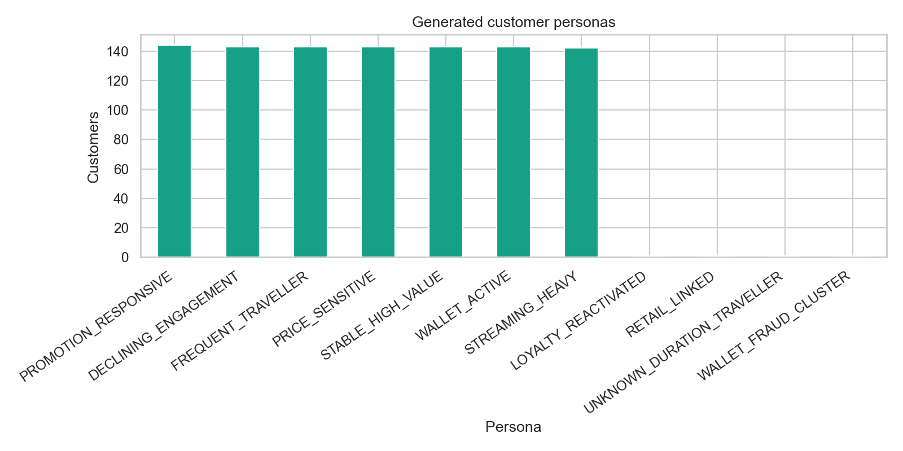

Alternative figure: `../../notebooks/00_dataset/outputs/plots/monthly_activity_trends.png`

### Speaker notes

The synthetic population is intentionally scenario-shaped. It proves reproducibility and capability flow; it does not prove real population behaviour or model accuracy.

---

## Slide 4 — Capability 01: outbox and Neo4j projection

### Main message

Neo4j is a rebuildable relationship projection derived from authoritative PostgreSQL data.

### Flow

```text
PostgreSQL snapshot + pending outbox
→ locked worker batch
→ managed Neo4j transaction
→ reconciliation
→ mark outbox PROCESSED after success
```

### What was implemented

- `GraphSnapshot` authoritative projection input
- `GraphProjector.rebuild(...)`
- `GraphRepository` as the only owner of Cypher
- Parameterized Cypher and idempotent `MERGE`
- Managed reset that preserves unrelated graph data
- Projection reconciliation and shared-device analysis

### Evidence metrics

- 1,010 projected customer nodes
- 1,005 wallet nodes
- 2,010 transaction nodes
- 22 shared-device cases
- Maximum customer degree: 6
- Source/projection reconciliation: true

### Notebook figure

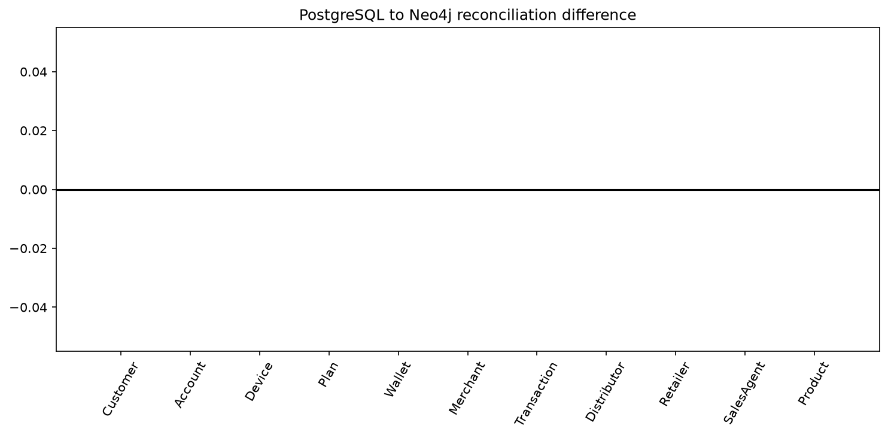

The zero line is the result: no reconciliation difference across the compared entities.

Alternative visual: `../../notebooks/01_graph_projection/outputs/plots/projection_graph_summary.png`

### Speaker notes

The POC performs a controlled snapshot rebuild instead of efficient event-level incremental projection. That is a deliberate simplicity/scalability trade-off.

---

## Slide 5 — Capability 02: temporal and graph feature layer

### Main message

One versioned feature contract combines point-in-time PostgreSQL evidence with bounded Neo4j relationship context.

### Flow

```text
PostgreSQL → TemporalFeatureService ┐
                                    ├→ CustomerFeatureService → CustomerFeatures
Neo4j      → GraphFeatureService    ┘
```

### Feature groups

- Usage and recharge
- Money and plan
- Travel and service
- Loyalty and campaigns
- Graph degree, shared devices, counterparties, merchants, and transactions

### Reproducibility design

- Contract version: `customer-features-v1`
- 30-day, 90-day, and previous-window comparison
- Deterministic UUID5 snapshot ID
- Explicit materialization command
- Graph-unavailable status with provenance and reasons

### Evidence metrics

- 15 materialized snapshots
- 29 numeric features
- 15 snapshots with graph context available
- Future-leakage failures: 0

### Notebook figure

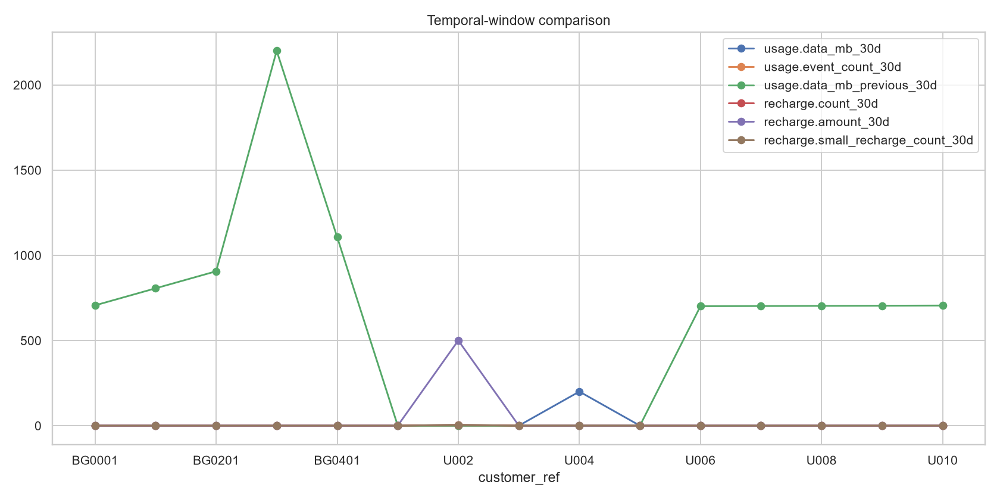

Alternative figure: `../../notebooks/02_features/outputs/plots/persona_profiles.png`

### Speaker notes

Emphasize that unavailable graph context is not converted to zero. Zero means observed absence; unavailable means the system could not observe the graph evidence.

---

## Slide 6 — Capability 03: event memory

### Main message

Travel events are reconstructed into episodes and matched against the current situation, with personal history ranked before peer or population history.

### Flow

```text
Travel + usage + subscription facts
→ point-in-time episode extraction
→ situation construction
→ similarity scoring
→ ranked historical matches
```

### Match priority

1. Same customer, same situation
2. Same customer, similar situation
3. Similar customers
4. Population

### Evidence scenario

- Previous Singapore trip duration: 6 days
- Previous usage: 11.4 GB
- Previous plan: `ROAM_15`
- Top August match: `SAME_CUSTOMER_SAME_SITUATION`
- Similarity: 0.95
- Future-leakage failures: 0

### Notebook figure

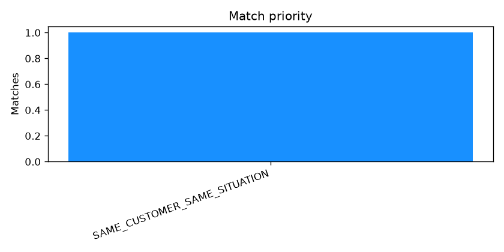

### UI evidence

`../ui/event_memory.png`

### Speaker notes

If the current trip has not ended by `as_of`, duration remains unknown. The system does not use a future end date just because it exists in the database later.

---

## Slide 7 — Capability 04: behaviour intelligence

### Main message

Behaviour traits are point-in-time inferences with confidence and evidence, not permanent customer facts.

### Flow

```text
CustomerFeatureService + EventMemoryService
→ BehaviourService
→ evidence-backed BehaviourTrait records
```

### What was implemented

- Deterministic online trait rules
- Confidence and supporting evidence for every trait
- No new SQL; the service consumes reusable contracts
- Notebook clustering compared with generator personas
- Clustering remains offline and is not loaded by the API

### Evidence metrics

- Behaviour version: `customer-behaviour-v1`
- 6 supported traits
- U001 identified as frequent traveller
- U002 identified as price sensitive
- 4 notebook clusters
- Online clustering: false

### Notebook figure

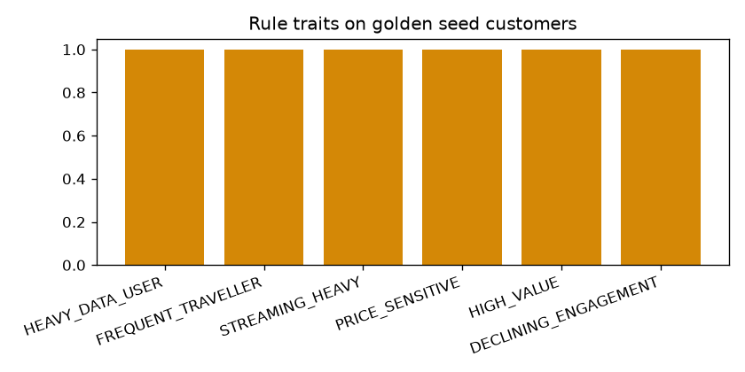

Alternative figure: `../../notebooks/04_behaviour/outputs/plots/cluster_vs_persona.png`

### Speaker notes

Clarify the difference between an observed fact and an inference. The source data may remain the same while trait thresholds or inference rules evolve.

---

## Slide 8 — Capability 05: churn prediction

### Main message

The churn capability compares models offline, then serves a transparent, versioned runtime artifact at an explicit `as_of`.

### Flow

```text
CustomerFeatures
→ training dataset
→ logistic regression vs gradient boosting
→ selected artifact
→ ChurnService
→ probability + risk band + drivers
```

### Model decision

Logistic regression was selected because its ROC-AUC advantage over gradient boosting was within the defined simplicity threshold, while remaining easier to explain and serve.

### Evidence metrics

| Model | ROC-AUC | PR-AUC | Brier |
|---|---:|---:|---:|
| Logistic regression | 0.9348 | 0.9145 | 0.0531 |
| Gradient boosting | 0.9178 | 0.8992 | 0.0564 |

- Training rows: 1,600
- Served model: `churn-lr-v1`
- U004 churn probability: 0.995, HIGH

### Notebook figure

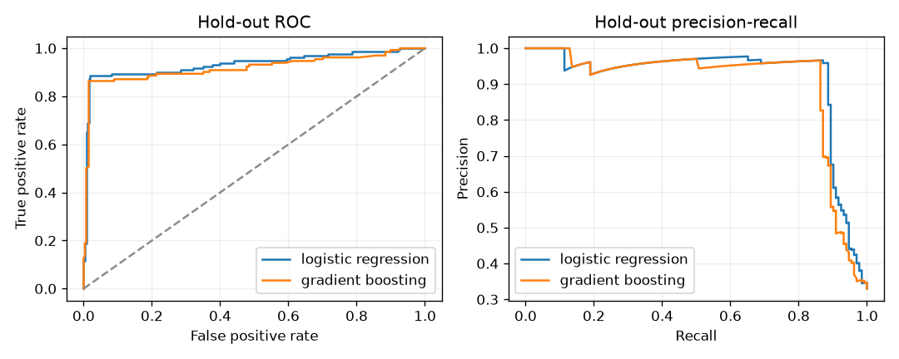

Alternative figure: `../../notebooks/05_churn/outputs/plots/lr_coefficients.png`

### Speaker notes

The runtime applies exported coefficients and scaler parameters without importing scikit-learn. These metrics are synthetic POC evidence, not a production accuracy claim.

---

## Slide 9 — Capability 06: recommendations and uncertainty

### Main message

Recommendations are generated only from the real catalogue and expose uncertainty instead of producing false precision.

### Flow

```text
EventMemoryService + PlanRepositoryCatalogue
→ candidate generation
→ deterministic scoring
→ uncertainty assessment
→ decision mode
→ ranked offers
```

### Decision modes

- `SINGLE_RECOMMENDATION`
- `RANKED_OPTIONS`
- `SCENARIO_BASED`
- `ASK_FOR_INFORMATION`
- `NO_RECOMMENDATION`

### Evidence scenario

- Destination: known
- Current trip duration: unknown
- Historical duration, plan, and usage: inferred
- Mode: `SCENARIO_BASED`
- Primary offer: `ROAM_15`
- Ranking: `ROAM_15`, `ROAM_30`, `ROAM_5`

### Notebook figure

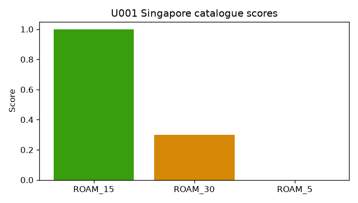

Alternative figure: `../../notebooks/06_recommendations/outputs/plots/uncertainty_status.png`

### Speaker notes

There is no free-form model-to-SKU mapping. The service cannot recommend a plan that is absent from the plan repository.

---

## Slide 10 — Capability 07: graph fraud

### Main message

Relationship evidence can reveal risk that transaction-only features miss.

### Recommended layout

- Left: generated graph relationship visual
- Right: notebook comparison chart and rule list

### Concept visual


### Scoring flow

```text
PostgreSQL transactions → TransactionRiskFeatures ┐
                                                   ├→ rules + scorer → CustomerFraud
Neo4j relationships   → GraphFraudFeatures        ┘
```

### Implemented rules

- Shared device
- Known fraud within two wallet/transfer hops
- Wallet funnel
- Circular transfers
- Abnormal creation
- Abnormal transaction velocity

### Evidence metrics

- U009 transaction-only risk: 0.335
- U009 graph risk: 1.0
- U009 risk band: HIGH
- Graph risk exceeds transaction risk: true

### Notebook figure

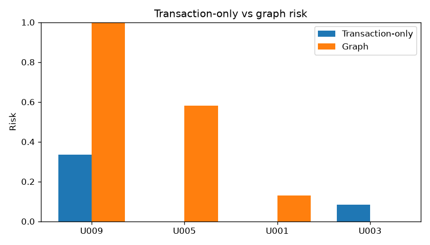

### Speaker notes

Keep transaction-only, graph-only, and combined evidence visible. When Neo4j is unavailable, graph risk remains unknown; it is never assumed to be zero.

---

## Slide 11 — Capability 08: SFA forecasting

### Main message

Retail demand is forecast from authoritative sales and inventory facts, then translated into stockout risk and a proposed action.

### Flow

```text
SFA sales + inventory facts
→ daily demand history
→ baseline and model comparison
→ versioned runtime artifact
→ forecast + stockout probability
→ RESTOCK / MONITOR / HOLD
```

### Models compared

- Naive
- Seasonal naive
- Moving average
- ARIMA/SARIMAX
- Prophet

### Evidence scenario

- Served model: ARIMA
- Retailer: `RET-001`
- Product: `POC-PROD-01`
- On hand: 18.26
- Forecast seven days: 49.06
- Actual seven days: 47.34
- Stockout warning: true

### Notebook figure

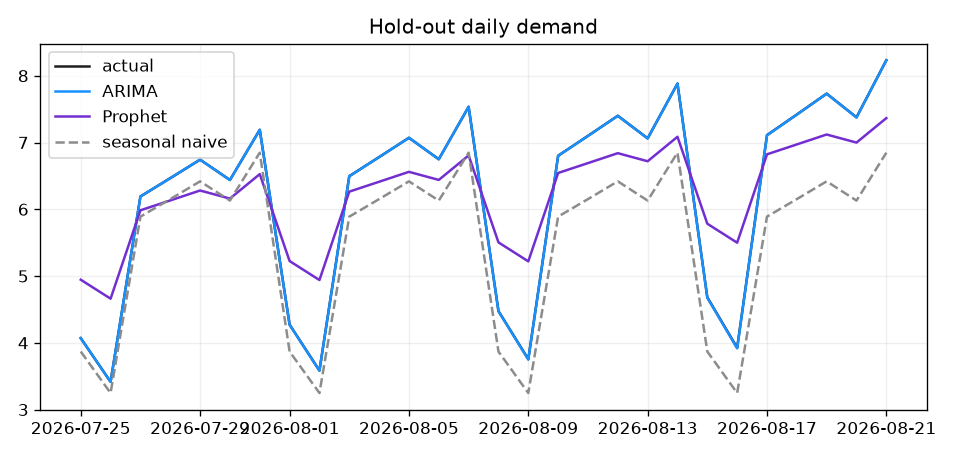

Alternative figures:

- `../../notebooks/08_sfa_forecasting/outputs/plots/model_comparison.png`
- `../../notebooks/08_sfa_forecasting/outputs/plots/stockout_cover.png`

### Speaker notes

The action is derived from the forecast and inventory cover; the model itself does not execute a restock. Supplier lead times and promotion effects remain production gaps.

---

## Slide 12 — Capability 09: computed digital twins

### Main message

A digital twin is a computed point-in-time composition of facts and intelligence, not another authoritative customer table.

### Flow

```text
Observed state
+ temporal and graph features
+ event memory
+ behaviour
+ churn
+ recommendations
→ DigitalTwinService.build(entity_id, as_of)
```

### Customer twin sections

`Observed · Recent · Historical · Relationships · Inferred · Predicted · Unknown · Recommended · Warnings`

### Evidence

- U001 recommendation mode: `SCENARIO_BASED`
- U001 primary offer: `ROAM_15`
- U001 traits: heavy data user, frequent traveller, streaming heavy
- U004 churn band: HIGH
- Graph, trip-duration, and feature-window unknowns remain visible

### Notebook figure

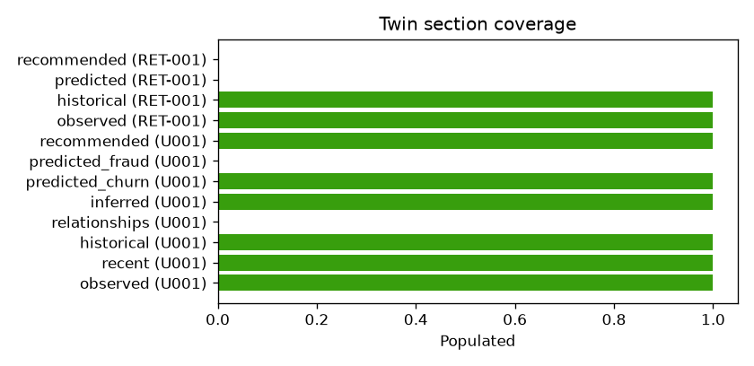

### UI evidence

`../ui/customer_360.png`

### Speaker notes

Some twin sections are deliberately unknown. Graph fraud and SFA forecasting remain separate panels where they are outside the bounded twin composition contract.

---

## Slide 13 — Capability 10: decision engine and explanations

### Main message

Predictions do not directly become business actions. The decision engine applies rules, eligibility, uncertainty, and explanation requirements.

### Flow

```text
RecommendationService + BehaviourService + ChurnService
→ deterministic DecisionEngine
→ action + target + reason codes + alternatives + unknowns
```

### Supported actions

- `PRESENT_OFFER`
- `SUPPORT_FOLLOW_UP`
- `REQUEST_INFORMATION`
- `NO_INVENTED_OFFER`

### Evidence scenarios

- U001: `PRESENT_OFFER` → `ROAM_15`
- U004: `SUPPORT_FOLLOW_UP`
- U002: `NO_INVENTED_OFFER`
- High churn can block upsell but cannot create a discount

### Explanation contract

`What · Why · Evidence · Confidence · Unknowns · Alternatives`

### Notebook figure

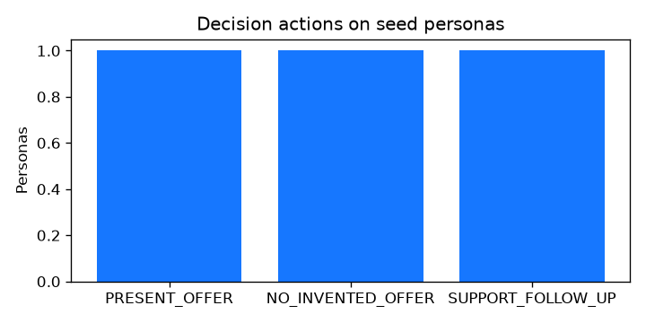

### UI evidence

`../ui/next_action.png`

### Speaker notes

Use the distinction: the churn model estimates what may happen; the decision engine determines what the business should do under explicit rules.

---

## Slide 14 — Capability 11: grounded Copilot

### Main message

Copilot is a presentation layer over the structured decision document. It cannot create facts, discounts, destinations, or plans.

### Flow diagram

```text
DecisionEngine
→ structured context pack
→ deterministic fallback or optional language model
→ grounding validation
→ CopilotAnswer
```

### Guardrails

- Deterministic fallback is always available
- Only catalogue plans contained in context may be mentioned
- Unsupported output is rejected
- Provider errors fall back safely
- API key remains environment-only
- No command execution or conversation memory

### Notebook evidence

- Source: deterministic fallback
- Mentions `ROAM_15`: true
- Mentions unknown trip duration: true
- Mentions a fake plan: false

### UI evidence

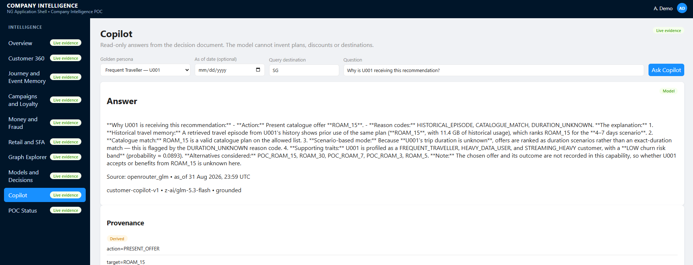

### Example grounded answer structure

```text
Action: PRESENT_OFFER
Target: ROAM_15
Evidence: historical episode + catalogue match
Unknown: current trip duration
Alternatives: ROAM_30, ROAM_5
```

### Speaker notes

The optional LLM does not receive permission to modify business state. Its job is to narrate a result that already exists. If grounding fails, the deterministic answer is used.

---

# Asset manifest

## Generated diagrams

| Use | Path |
|---|---|
| Data-layer architecture | `docs/presentation/assets/generated/01-capability-architecture.png` |
| Transactional outbox | `docs/presentation/assets/generated/02-transactional-outbox.png` |
| Graph fraud context | `docs/presentation/assets/generated/03-graph-fraud-context.png` |

## Notebook figures

| Capability | Primary figure |
|---|---|
| 00 Dataset | `notebooks/00_dataset/outputs/plots/persona_distribution.png` |
| 01 Graph projection | `notebooks/01_graph_projection/outputs/plots/source_projection_reconciliation.png` |
| 02 Features | `notebooks/02_features/outputs/plots/temporal_windows.png` |
| 03 Event memory | `notebooks/03_event_memory/outputs/plots/match_priority.png` |
| 04 Behaviour | `notebooks/04_behaviour/outputs/plots/trait_counts.png` |
| 05 Churn | `notebooks/05_churn/outputs/plots/model_comparison.png` |
| 06 Recommendations | `notebooks/06_recommendations/outputs/plots/candidate_scores.png` |
| 07 Graph fraud | `notebooks/07_graph_fraud/outputs/plots/transaction_vs_graph.png` |
| 08 SFA forecasting | `notebooks/08_sfa_forecasting/outputs/plots/hero_forecast.png` |
| 09 Digital twins | `notebooks/09_digital_twins/outputs/plots/section_coverage.png` |
| 10 Decision engine | `notebooks/10_decisioning/outputs/plots/decision_actions.png` |
| 11 Copilot | No notebook plot; use `docs/ui/copiliot.png` and notebook fallback table |

## UI screenshots

| Use | Path |
|---|---|
| Customer 360 | `docs/ui/customer_360.png` |
| Event memory | `docs/ui/event_memory.png` |
| Graph Explorer | `docs/ui/gragh.png` |
| Decision / next action | `docs/ui/next_action.png` |
| Copilot | `docs/ui/copiliot.png` |

# Presentation design notes

- Use dark navy as the base canvas.
- Use cyan for PostgreSQL facts and temporal data.
- Use violet for Neo4j relationships.
- Use amber for derived intelligence, recommendations, and decisions.
- Use restrained coral for fraud warnings.
- Preserve notebook charts as evidence, but place them inside clean dark cards with short captions.
- Do not stretch raster figures; crop whitespace when placing them in the final deck.
- Keep one primary visual and no more than three short technical callouts per slide.
- Add `Synthetic POC evidence` as a small footer on modelling slides.
- Add labels and arrows as editable PowerPoint elements rather than modifying the generated diagrams.
