# Telco Digital — Technical Presentation Notes v1

This document is the detailed technical narrative for presenting the Telco Digital shared-intelligence POC. It follows the 14-slide structure in `ppt_content_v2.md` and focuses on architecture, data, capability behaviour, technical reasoning, evidence, and limitations rather than source-code explanation.

## Presentation objective

The goal is to demonstrate that the work is more than a collection of isolated models. It is an end-to-end intelligence platform that connects:

```text
Operational facts
→ historical and relationship context
→ reusable features
→ intelligence capabilities
→ governed decisions
→ explanations and presentation
```

The central technical argument is:

> Intelligence is trustworthy only when its source facts, time boundaries, relationships, model versions, uncertainty, and business rules are explicit.

## Recommended opening

> “I built a shared-intelligence POC for telecom and retail use cases. PostgreSQL stores authoritative facts and history, Neo4j provides rebuildable relationship context, temporal services reconstruct the customer at a selected time, and several intelligence capabilities reuse those contracts. Predictions do not directly execute actions; a separate decision layer applies business rules and produces explanations.”

## Core terminology

| Term | Meaning in this platform |
|---|---|
| Fact | An observed business event or state recorded by the platform |
| Ledger | Append-only record of value changes used for reconstruction |
| Event | Immutable statement that something happened |
| Feature | A calculated value derived from facts at a selected time |
| Inference | Interpreted behaviour or trait derived from evidence |
| Prediction | A model estimate such as churn probability |
| Recommendation | A ranked valid option from the product catalogue |
| Decision | A governed action selected under rules and uncertainty |
| Explanation | The reason, evidence, alternatives, confidence, and unknowns |
| Digital twin | A computed point-in-time view combining facts and intelligence |

## Flowchart legend

The diagrams use the same visual meaning throughout the document:

- Blue: authoritative facts and operational data
- Purple: Neo4j relationship context
- Amber: derived features, intelligence, or predictions
- Green: governed decisions and presentation outputs
- Gray: unknown or unavailable information

---

# Slide 1 — Data layer I: authoritative facts and domain separation

## Core message

PostgreSQL is the authoritative source of truth. The platform separates domain facts, event history, asynchronous integration, and derived intelligence so that each type of information has a clear meaning and lifecycle.

## Explanation flowchart

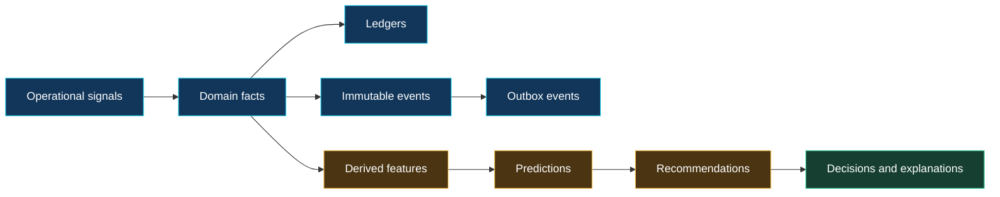

## Presentation visual


Use this visual to explain the complete journey from operational signals and authoritative databases to temporal context, graph relationships, intelligence modules, a computed twin, governed decisions, and the final application experience.

Supporting live UI evidence:


## Technical details to present

### Domain separation

The database is divided into logical schemas:

- `core` contains stable entities such as customers, accounts, SIMs, devices, plans, and subscriptions.
- `telco` contains usage, recharge, travel, service interactions, and balance-ledger activity.
- `money` contains wallets, merchants, and money transactions.
- `marketing` contains loyalty and campaign signals.
- `sfa` contains retailers, products, sales, inventory, and promotion-related facts.
- `activity` contains immutable cross-domain events.
- `integration` contains outbox events used for reliable graph projection.
- `intelligence` contains derived outputs such as feature snapshots, predictions, recommendations, and warnings.

### Why schema separation matters

The separation prevents ambiguity. A recharge is an observed business fact. A churn probability is a model output. A recommendation is a proposed action. If these records are mixed together, the system cannot clearly answer which values are authoritative, which can be recalculated, and which depend on a model version.

### Ledger design

A current balance column answers only “what is the balance now?” A ledger answers:

- What changed the balance?
- When did the change happen?
- What was the balance at an earlier time?
- Which transaction was responsible?

Historical balance is reconstructed by summing ledger entries up to the selected time.

### Source-of-truth rule

PostgreSQL remains authoritative even when Neo4j or a model service is unavailable. Relationship projections and intelligence outputs can be rebuilt or recalculated from PostgreSQL facts.

### Derived-intelligence rule

Features, inferences, predictions, and recommendations are stored separately because they can change when:

- The selected `as_of` changes
- A feature definition changes
- A model version changes
- A catalogue changes
- New evidence becomes available

### Digital-twin rule

The digital twin is computed from the current contracts. It is not treated as a master customer record because that would duplicate authority and eventually become stale.

## Strong interview statement

> “I designed the data layer so that for any prediction or decision, we can identify the source facts, the selected time, the feature version, and the reasoning that produced the result.”

## Likely follow-up question

### Why not store everything in one customer table?

Because current state, event history, model outputs, and recommendations have different consistency and lifecycle requirements. Combining them would make historical reconstruction, model auditing, and correction difficult.

---

# Slide 2 — Data layer II: atomic writes, events, and graph projection

## Core message

Important operations are written atomically to PostgreSQL, while Neo4j is updated asynchronously through a transactional outbox.

## Explanation flowchart

```mermaid
flowchart LR
    C[Application command] --> T{PostgreSQL transaction}
    T --> A[Domain fact]
    T --> E[Activity event]
    T --> O[Outbox event]
    A --> K[Atomic commit]
    E --> K
    O --> K
    K --> W[Projection worker]
    W --> G[Neo4j projection]
    W -. retry on failure .-> W

    classDef fact fill:#12365a,stroke:#22d3ee,color:#ffffff
    classDef graph fill:#35255e,stroke:#a78bfa,color:#ffffff
    classDef derived fill:#4a3412,stroke:#f5b942,color:#ffffff
    class C,T,A,E,K fact
    class O,W derived
    class G graph
```

## Presentation visual


Suggested editable labels for the final slide:

`Command · Atomic transaction · PostgreSQL commit · Outbox worker · Neo4j projection`

## Technical details to present

### Atomic write path

One PostgreSQL transaction contains:

1. The domain fact
2. The immutable activity event
3. The outbox event

For example, a plan purchase can create:

- A subscription fact
- A balance-ledger entry
- A `PLAN_PURCHASED` activity event
- A graph-projection outbox event

If any part fails, the full transaction is rolled back.

### Why direct dual writes are unsafe

Writing to PostgreSQL and Neo4j during the same API request creates partial-success risk:

- PostgreSQL succeeds and Neo4j fails
- Neo4j succeeds and PostgreSQL fails
- The request times out after one side commits

The outbox changes the problem. PostgreSQL commits the business operation and a durable delivery instruction together. A separate worker can retry graph projection safely.

### Event timestamps

The event model keeps two timestamps:

- `occurred_at`: when the business activity happened
- `recorded_at`: when this platform received or stored it

This supports delayed and out-of-order events.

### Projection worker

The worker:

1. Claims pending outbox records
2. Loads the authoritative graph snapshot
3. Projects managed nodes and relationships
4. Reconciles source and graph counts
5. Marks the batch processed only after success

### Idempotency

Graph writes use `MERGE`-style semantics. Replaying the same projection does not create duplicate managed nodes or relationships.

### Rebuildability

Neo4j can be cleared for the managed projection and rebuilt from PostgreSQL. This is a powerful recovery property because graph corruption or projection failure does not destroy authoritative business data.

### POC trade-off

The POC uses a controlled full-snapshot rebuild. This is operationally simple and easy to reconcile, but a production platform would normally move toward incremental event-level projection, distributed workers, exponential retry, dead-letter queues, lag monitoring, and alerting.

## Strong interview statement

> “I did not try to create a distributed transaction across PostgreSQL and Neo4j. I used the transactional-outbox pattern so the business write remains correct and graph delivery becomes retryable.”

---

# Slide 3 — Capability 00: deterministic POC dataset

## Core message

The POC uses reproducible synthetic data that covers multiple business domains and provides controlled scenarios for every later capability.

## Explanation flowchart


## Notebook evidence

### Generated persona distribution


The background personas are intentionally balanced so later notebooks can compare known behavioural scenarios without severe class imbalance.

### Cross-domain activity over time

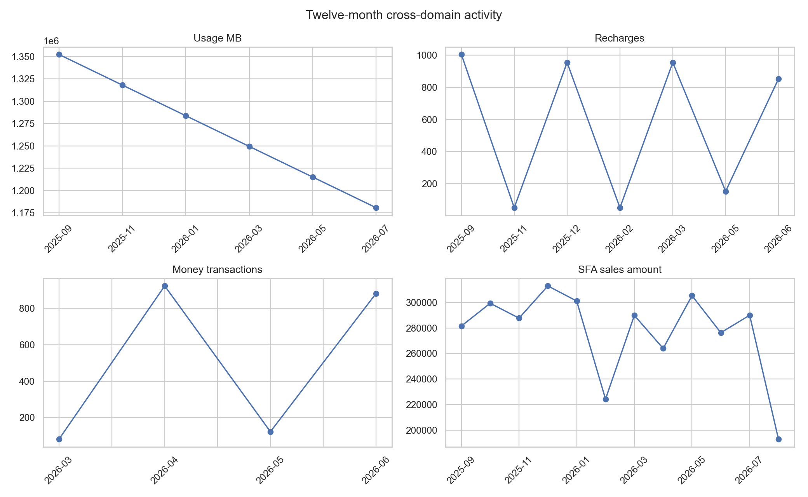

### Supporting artifacts

- [Dataset metrics](../../notebooks/00_dataset/outputs/metrics.json)
- [Table row counts](../../notebooks/00_dataset/outputs/tables/table_row_counts.json)
- [Persona distribution data](../../notebooks/00_dataset/outputs/tables/persona_distribution.json)

## Technical details to present

### Why the dataset was necessary

The intelligence capabilities require correlated signals, not isolated random rows. For example:

- Churn needs declining usage and engagement patterns.
- Event memory needs repeated travel episodes.
- Recommendations need historical trip duration, plan, and usage.
- Graph fraud needs shared devices, wallets, merchants, and suspicious paths.
- SFA forecasting needs retailer sales and inventory history.

### Dataset composition

The dataset contains:

- Golden customers with named behaviours and expected outcomes
- 1,000 background customers for population context
- Telecom, loyalty, marketing, mobile-money, service, and SFA records
- Activity events and matching outbox records
- Time-ordered data covering a controlled one-year period

### Determinism

The generator uses a fixed dataset version and seed. Repeated generation produces the same scenario structure, enabling reproducible tests, notebook outputs, and demonstrations.

### Evidence

- 1,005 generated customers in the expanded dataset
- 19,772 activity events
- 19,772 outbox events
- Event/outbox parity is true
- 6,030 usage events
- 4,020 recharges
- 2,010 money transactions
- 1,200 sales records
- Dataset validation is true

### Important limitation

The population is scenario-shaped. It demonstrates the technical workflow and expected behaviours but does not represent real customer distributions or prove model accuracy.

## Strong interview statement

> “The dataset is synthetic, but it is not arbitrary. It is deterministic and designed to exercise cross-domain scenarios with known expected results.”

---

# Slide 4 — Capability 01: Neo4j projection

## Core message

Neo4j stores rebuildable relationship context, not authoritative customer state or changing predictions.

## Explanation flowchart

```mermaid
flowchart LR
    P[(PostgreSQL facts)] --> S[Authoritative graph snapshot]
    O[Pending outbox] --> W[Projection worker]
    S --> W
    W --> N[(Neo4j managed projection)]
    N --> R[Source versus graph reconciliation]
    R --> C[Processed checkpoint]
    N -. clear and replay .-> S

    classDef fact fill:#12365a,stroke:#22d3ee,color:#ffffff
    classDef graph fill:#35255e,stroke:#a78bfa,color:#ffffff
    classDef derived fill:#4a3412,stroke:#f5b942,color:#ffffff
    class P,S,O fact
    class W,R,C derived
    class N graph
```

## Notebook and UI evidence

### Source-to-projection reconciliation


The zero line is the important result: the compared source and projected entity counts have no difference.

### Projected graph composition

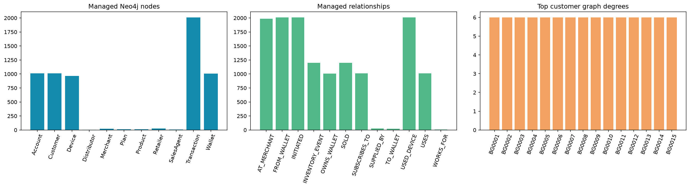

### Live Graph Explorer

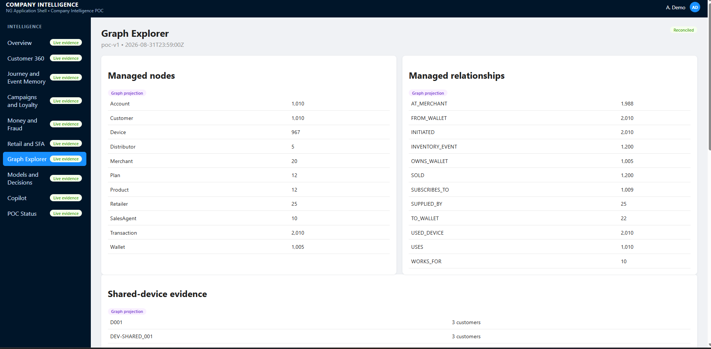

### Supporting artifacts

- [Projection metrics](../../notebooks/01_graph_projection/outputs/metrics.json)
- [Reconciliation table](../../notebooks/01_graph_projection/outputs/tables/reconciliation.json)
- [Shared-device evidence](../../notebooks/01_graph_projection/outputs/tables/shared_devices.json)

## Technical details to present

### Relationship model

The projection includes entities such as:

- Customer
- Account
- Device
- Plan
- Wallet
- Merchant
- Transaction
- Distributor
- Retailer
- Sales agent
- Product

Relationships represent observed connections, including:

- Customer uses device
- Customer owns wallet
- Customer subscribes to plan
- Transaction originates from wallet
- Transaction goes to wallet or merchant
- Retailer is supplied by distributor
- Sales agent works for an organisation

### Why Neo4j is a projection

Graph databases are useful for traversal, but PostgreSQL provides the primary transaction and history guarantees needed by the business system. Keeping the graph rebuildable avoids two competing sources of truth.

### Reconciliation

After rebuilding the graph, the system compares source entities and projected node counts. The notebook evidence shows zero reconciliation difference for the compared entity categories.

### Evidence

- 1,010 customer nodes
- 1,010 account nodes
- 967 device nodes
- 1,005 wallet nodes
- 2,010 transaction nodes
- 22 shared-device cases
- Maximum customer degree: 6
- Projection reconciled: true

### Important limitation

The worker is a controlled single-worker POC. It does not demonstrate production throughput, distributed locking, or continuous projection-lag monitoring.

## Strong interview statement

> “Neo4j gives us relationship traversal, but PostgreSQL still owns the facts. If the graph disappears, we can rebuild it and prove that it matches the source.”

---

# Slide 5 — Capability 02: temporal and graph feature layer

## Core message

A single versioned feature contract combines bounded relational and graph evidence for a customer at a selected time.

## Explanation flowchart

```mermaid
flowchart LR
    P[(PostgreSQL facts)] --> T[Temporal windows at as_of]
    N[(Neo4j projection)] --> G[Graph features at as_of]
    T --> C[Customer feature contract]
    G --> C
    C --> V[Versioned snapshot]
    U[Graph unavailable] -. availability and unknowns .-> C

    classDef fact fill:#12365a,stroke:#22d3ee,color:#ffffff
    classDef graph fill:#35255e,stroke:#a78bfa,color:#ffffff
    classDef derived fill:#4a3412,stroke:#f5b942,color:#ffffff
    classDef unknown fill:#374151,stroke:#9ca3af,color:#ffffff
    class P,T fact
    class N,G graph
    class C,V derived
    class U unknown
```

## Notebook evidence

### Temporal-window comparison


This figure demonstrates that current and previous windows are distinct feature inputs rather than one mutable customer total.

### Feature profiles by persona

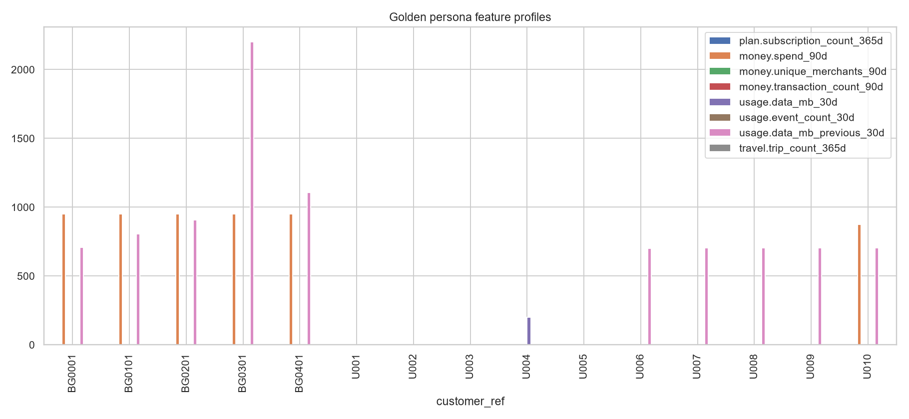

### Missingness and unknowns

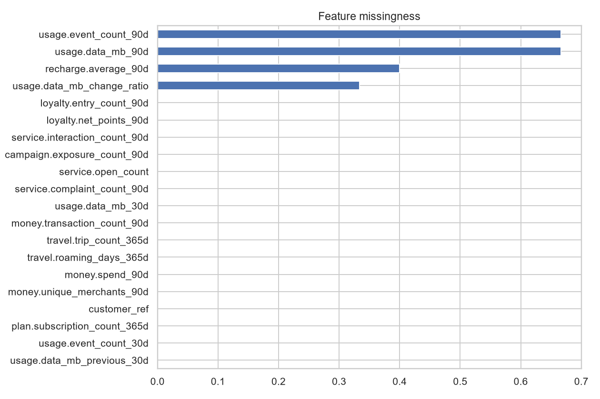

### Supporting artifacts

- [Feature metrics](../../notebooks/02_features/outputs/metrics.json)
- [Feature profiles](../../notebooks/02_features/outputs/tables/feature_profiles.json)
- [Future-leakage validation](../../notebooks/02_features/outputs/tables/future_leakage_validation.json)
- [Missingness table](../../notebooks/02_features/outputs/tables/missingness.json)

## Technical details to present

### Temporal features

Temporal features are calculated from PostgreSQL facts using time windows such as:

- Last 30 days
- Last 90 days
- Previous 30-day window
- Change between current and previous windows

Feature groups include:

- Usage
- Recharge
- Money
- Plan
- Travel
- Service
- Loyalty
- Campaign

### Graph features

Relationship features include:

- Customer degree
- Shared-device context
- Counterparty counts
- Merchant relationships
- Transaction neighbourhood context

Graph relationships are bounded by the same `as_of` principle where temporal relationship properties allow it.

### Feature contract

The contract version is `customer-features-v1`. Versioning ensures downstream models and decisions know which definitions produced the values.

### Deterministic snapshots

The snapshot identity is deterministically derived from:

- Customer identity
- `as_of`
- Feature version

Materializing the same snapshot again updates the same logical record rather than creating unrelated duplicates.

### Read versus materialization

Feature retrieval is read-only. Persistence happens only through an explicit materialization process, preventing ordinary query calls from causing hidden writes.

### Unknown handling

If graph context is unavailable, the contract reports:

- Availability status
- Provenance
- Reason for unavailability
- Unknown graph values

It does not fabricate zeros.

### Evidence

- 15 feature snapshots
- 29 numeric features
- Graph available for all 15 notebook snapshots
- Future-leakage checks failed: 0

## Strong interview statement

> “The feature layer is the reusable boundary between raw operational data and intelligence. Models do not independently query business tables and redefine features.”

---

# Slide 6 — Capability 03: event memory

## Core message

Event memory reconstructs historical travel episodes and retrieves the most relevant previous experience for the current situation.

## Explanation flowchart

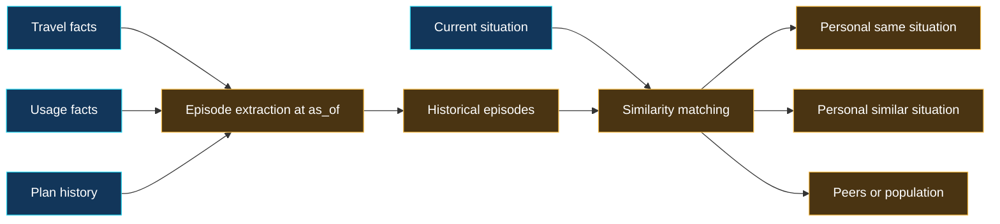

## Notebook and UI evidence

### Episode similarity

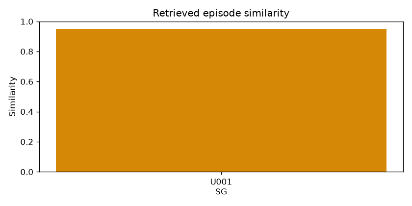

### Retrieval priority


### Live journey and memory view

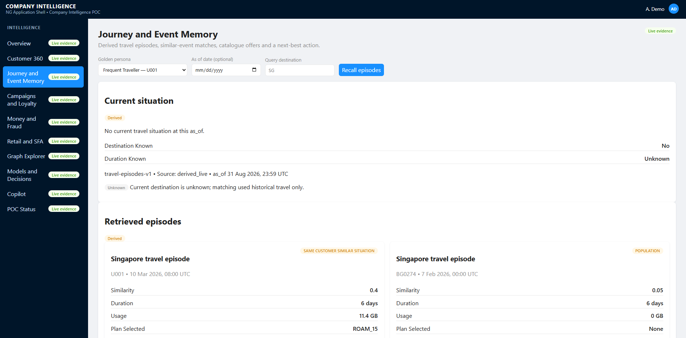

### Supporting artifacts

- [Event-memory metrics](../../notebooks/03_event_memory/outputs/metrics.json)
- [Historical U001 episode](../../notebooks/03_event_memory/outputs/tables/u001_march_episode.json)
- [Match ranks](../../notebooks/03_event_memory/outputs/tables/match_ranks.json)
- [Future-leakage validation](../../notebooks/03_event_memory/outputs/tables/future_leakage_validation.json)

## Technical details to present

### Episode construction

A travel episode combines:

- Destination
- Start time
- Effective end time
- Duration when known
- Data usage during the trip
- Active roaming plan
- Outcome derived from the observed facts

### Point-in-time correctness

If a trip ends after the selected `as_of`, the future end time is not used. Duration remains unknown at that historical point.

### Retrieval hierarchy

Matches are ranked in this order:

1. Same customer and same situation
2. Same customer and similar situation
3. Similar customers
4. Population history

This avoids using population averages when stronger personal evidence is available.

### Evidence scenario

For U001:

- Historical Singapore trip duration: 6 days
- Historical usage: 11.4 GB
- Historical plan: `ROAM_15`
- Recorded outcome: no additional package required
- New situation top rank: same customer, same situation
- Similarity: 0.95
- Future-leakage checks failed: 0

### Current limitation

Episodes are reconstructed from facts rather than stored in a durable event-memory database. Retrieval uses deterministic similarity rather than embeddings or learned retrieval.

## Strong interview statement

> “The recommendation can use the customer’s own previous experience before making assumptions from other customers.”

---

# Slide 7 — Capability 04: behaviour intelligence

## Core message

Behaviour traits are explainable inferences derived from features and episodes at a selected time.

## Explanation flowchart

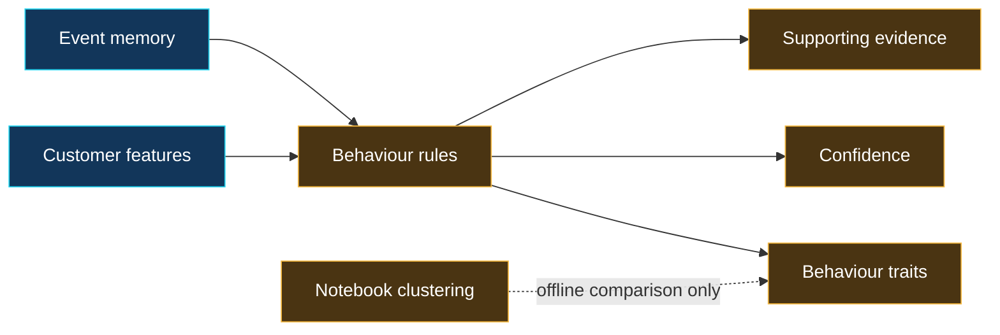

## Notebook evidence

### Deterministic behaviour traits


### Offline cluster comparison

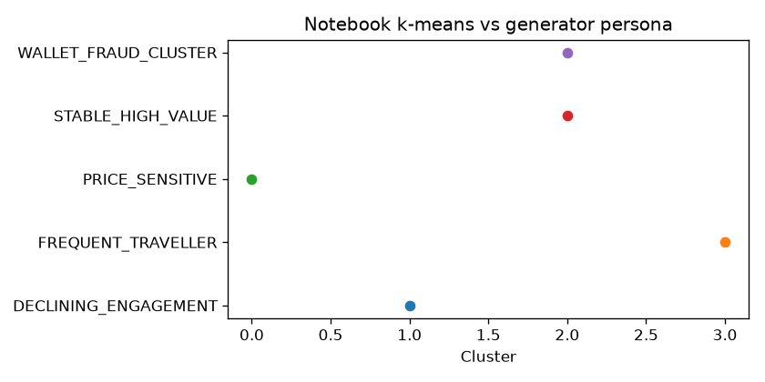

The second figure is analysis evidence only; the served behaviour contract remains deterministic and evidence-backed.

### Supporting artifacts

- [Behaviour metrics](../../notebooks/04_behaviour/outputs/metrics.json)
- [Golden customer traits](../../notebooks/04_behaviour/outputs/tables/golden_traits.json)
- [Price-sensitive U002 evidence](../../notebooks/04_behaviour/outputs/tables/u002_price_sensitive.json)
- [Cluster comparison data](../../notebooks/04_behaviour/outputs/tables/cluster_vs_persona.json)

## Technical details to present

### Behaviour versus fact

`FREQUENT_TRAVELLER` is not an immutable customer fact. It is an inference supported by observed travel history. If evidence or thresholds change, the trait can change.

### Online behaviour logic

The runtime uses deterministic rules. Each trait includes:

- Trait name
- Confidence
- Supporting evidence
- Version and point-in-time context

### Offline clustering

Notebook clustering compares unsupervised groups with the personas used by the synthetic generator. It is analysis evidence, not an online model loaded by the application.

### Why deterministic traits are useful

- Easy to explain
- Easy to test
- Stable for POC demonstration
- Clear relationship between evidence and label
- Useful inputs for recommendations and decisions

### Evidence

- Behaviour version: `customer-behaviour-v1`
- 6 supported traits
- U001: frequent traveller
- U002: price sensitive
- 4 offline notebook clusters
- Online clustering: false

### Limitation

Thresholds are demonstrative and require validation against real customer outcomes before production use.

## Strong interview statement

> “I kept the served traits deterministic and evidence-backed. Clustering was used to analyse the population, not silently converted into customer truth.”

---

# Slide 8 — Capability 05: churn prediction

## Core message

The churn capability separates offline model comparison from lightweight, versioned runtime scoring.

## Explanation flowchart

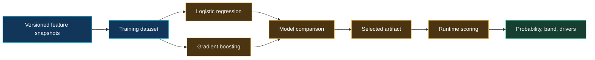

## Notebook evidence

### Hold-out model comparison


### Interpretable logistic-regression drivers

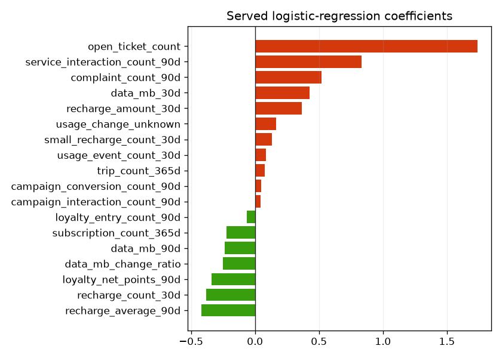

### Golden-customer risk bands

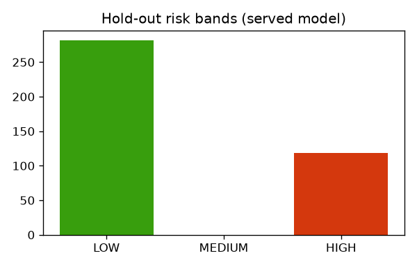

### Supporting artifacts

- [Churn metrics](../../notebooks/05_churn/outputs/metrics.json)
- [Model comparison table](../../notebooks/05_churn/outputs/tables/model_comparison.json)
- [Logistic coefficients](../../notebooks/05_churn/outputs/tables/lr_coefficients.json)
- [Golden customer scores](../../notebooks/05_churn/outputs/tables/golden_scores.json)
- [Served model artifact](../../notebooks/05_churn/artifacts/churn-model-v1.json)

## Technical details to present

### Model comparison

Two supervised approaches were compared:

- Logistic regression
- Gradient-boosted trees

The selected model was logistic regression because it performed slightly better in the recorded hold-out comparison and remained simpler to explain and serve.

### Evidence metrics

| Model | ROC-AUC | PR-AUC | Brier score | Log loss |
|---|---:|---:|---:|---:|
| Logistic regression | 0.9348 | 0.9145 | 0.0531 | 0.2281 |
| Gradient boosting | 0.9178 | 0.8992 | 0.0564 | 0.2525 |

### Runtime artifact

The runtime uses exported coefficients and scaling parameters rather than loading the training framework. This reduces runtime dependencies and makes the scoring implementation transparent.

### Output contract

The churn result includes:

- Probability
- Risk band
- Primary drivers
- Model version
- Feature snapshot
- `as_of`

### Risk bands

- High: probability at or above 0.60
- Medium: probability at or above 0.35 and below 0.60
- Low: below 0.35

### Example

U004 receives approximately 0.995 churn probability and a HIGH risk band.

### Important limitation

The labels are generated from synthetic personas. The metrics prove the model-training and serving pipeline, not real-world churn accuracy or calibration.

## Strong interview statement

> “I selected the model using both performance and operational simplicity. The runtime result is versioned and tied back to the feature snapshot that produced it.”

---

# Slide 9 — Capability 06: recommendations and uncertainty

## Core message

The recommendation service ranks only valid catalogue products and changes its decision mode when important information is unknown.

## Explanation flowchart

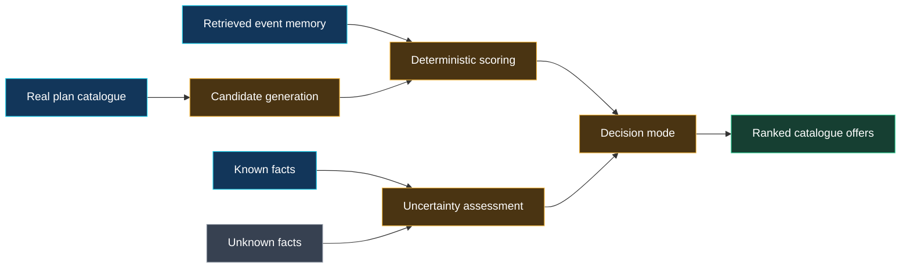

## Notebook evidence

### Catalogue candidate scores


### Known, inferred, and unknown inputs

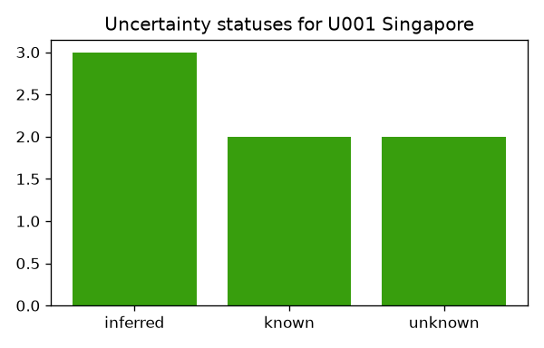

### Supporting artifacts

- [Recommendation metrics](../../notebooks/06_recommendations/outputs/metrics.json)
- [U001 ranked offers](../../notebooks/06_recommendations/outputs/tables/u001_ranked.json)
- [Decision modes](../../notebooks/06_recommendations/outputs/tables/decision_modes.json)
- [Invented-plan rejection proof](../../notebooks/06_recommendations/outputs/tables/invented_plan_rejected.json)

## Technical details to present

### Candidate generation

Candidates come from the real plan catalogue. A model or language model cannot invent a product identifier.

### Evidence sources

Recommendation scoring can use:

- Current destination
- Current duration when known
- Historical trip duration
- Previous plan
- Previous usage
- Previous outcome
- Catalogue eligibility and scenario fit

### Uncertainty categories

Evidence is classified as:

- Known
- Inferred
- Predicted
- Unknown

### Decision modes

- Single recommendation
- Ranked options
- Scenario based
- Ask for information
- No recommendation

### Example scenario

For U001:

- Destination is known
- Current trip duration is unknown
- Historical duration, plan, and usage are inferred from memory
- Decision mode is `SCENARIO_BASED`
- `ROAM_15` is ranked first
- `ROAM_30` and `ROAM_5` remain alternatives

### Why scenario mode matters

Without current duration, returning one exact plan with false certainty would hide risk. Scenario mode presents options based on plausible duration ranges.

### Current limitation

Ranking is deterministic, not a learned ranker. Outcome feedback and acceptance tracking are not yet part of this capability.

## Strong interview statement

> “The system never invents a plan, and it does not hide missing information. Unknown duration changes the response from an exact answer to scenario-based options.”

---

# Slide 10 — Capability 07: graph fraud

## Core message

Graph context exposes connected risk that transaction-only analysis may miss.

## Explanation flowchart

```mermaid
flowchart LR
    P[(PostgreSQL transactions)] --> T[Transaction-risk features]
    N[(Neo4j relationships)] --> G[Graph-risk features]
    T --> R[Deterministic fraud rules]
    G --> R
    R --> S[Separate and combined scores]
    S --> E[Risk band, drivers, evidence]
    U[Graph unavailable] -. unknown, not zero .-> S

    classDef fact fill:#12365a,stroke:#22d3ee,color:#ffffff
    classDef graph fill:#35255e,stroke:#a78bfa,color:#ffffff
    classDef derived fill:#4a3412,stroke:#f5b942,color:#ffffff
    classDef unknown fill:#374151,stroke:#9ca3af,color:#ffffff
    classDef output fill:#163f32,stroke:#34d399,color:#ffffff
    class P,T fact
    class N,G graph
    class R,S derived
    class U unknown
    class E output
```

## Concept, notebook, and UI evidence

### Relationship-context concept


### Transaction-only versus graph risk


### Deterministic rule firings

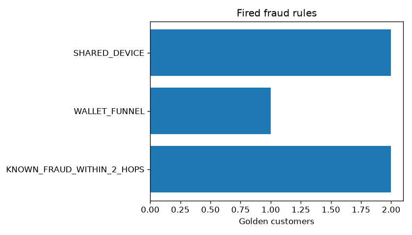

### Supporting artifacts

- [Fraud metrics](../../notebooks/07_graph_fraud/outputs/metrics.json)
- [Transaction-versus-graph data](../../notebooks/07_graph_fraud/outputs/tables/transaction_vs_graph.json)
- [U009 fired rules](../../notebooks/07_graph_fraud/outputs/tables/u009_rules.json)
- [Golden customer fraud scores](../../notebooks/07_graph_fraud/outputs/tables/golden_scores.json)

## Technical details to present

### Two independent evidence sources

Transaction risk uses PostgreSQL money activity, such as:

- Transaction amount and velocity
- Counterparty activity
- Account or wallet creation timing
- Circular movement visible in recorded transfers

Graph risk uses Neo4j relationships, such as:

- Shared devices
- Suspicious neighbours
- Wallet funnels
- Bounded distance to known fraud
- Connected merchant or wallet patterns

### Implemented deterministic rules

- Shared device
- Known fraud within two wallet/transfer hops
- Wallet funnel
- Circular transfers
- Abnormal creation
- Abnormal transaction velocity

### Important modelling detail

Shared-device risk is evaluated separately from wallet-based known-fraud distance. This prevents a shared device alone from being incorrectly interpreted as a wallet-transfer fraud path.

### Score transparency

The result preserves:

- Transaction-only risk
- Graph risk
- Combined risk
- Fired rules
- Drivers
- Unknowns

### Evidence scenario

For U009:

- Transaction-only risk: 0.335
- Graph risk: 1.0
- Final risk band: HIGH
- Graph risk exceeds transaction-only risk: true

### Graph-unavailable behaviour

If Neo4j is unavailable, graph evidence remains unknown. The system does not report zero graph risk because zero would incorrectly imply that the relationships were observed and safe.

### Current limitation

The POC does not block transactions, create a review queue, or serve graph embeddings. It demonstrates scoring and evidence only.

## Strong interview statement

> “The graph is valuable because it changes the evidence. U009 looks only moderately risky from its own transactions, but its connected neighbourhood produces maximum graph risk.”

---

# Slide 11 — Capability 08: SFA forecasting

## Core message

Retail demand is forecast from authoritative sales and inventory facts, then translated into stockout risk and a proposed action.

## Explanation flowchart

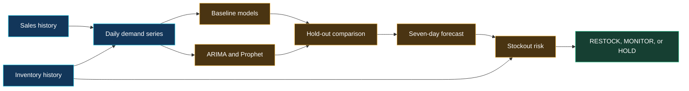

## Notebook evidence

### Hold-out demand forecast


### Forecast-model comparison

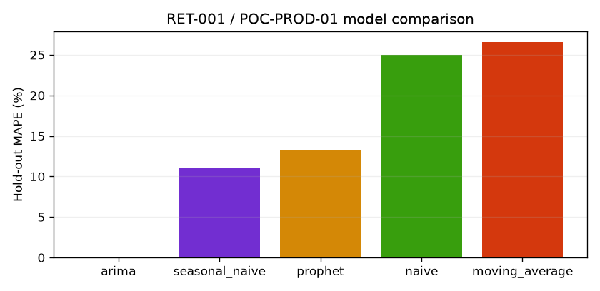

### Stockout cover

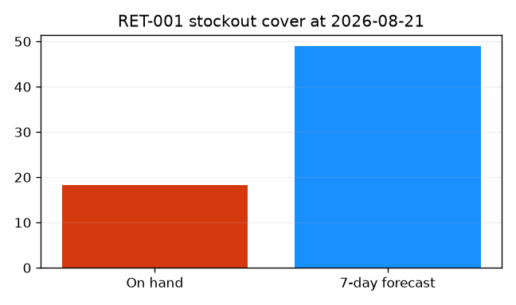

### Supporting artifacts

- [Forecast metrics](../../notebooks/08_sfa_forecasting/outputs/metrics.json)
- [Hero forecast data](../../notebooks/08_sfa_forecasting/outputs/tables/hero_forecast.json)
- [Model comparison table](../../notebooks/08_sfa_forecasting/outputs/tables/model_comparison.json)
- [Reconstruction evidence](../../notebooks/08_sfa_forecasting/outputs/tables/reconstruction.json)
- [Served forecast artifact](../../notebooks/08_sfa_forecasting/artifacts/sfa-forecast-v1.json)

## Technical details to present

### Time-series inputs

- Historical retailer sales
- Product-level inventory observations
- Daily demand series derived from the recorded POC facts
- Explicit forecast `as_of`

### Models compared

- Naive
- Seasonal naive
- Moving average
- ARIMA/SARIMAX
- Prophet

### Model-selection evidence

Recorded hold-out MAPE:

- Naive: 25.0031%
- Seasonal naive: 11.1372%
- Moving average: 26.6045%
- ARIMA: 0.0367%
- Prophet: 13.1731%

ARIMA is the served model in the POC artifact.

### Runtime output

- Seven-day demand forecast
- On-hand inventory
- Inventory cover
- Stockout probability
- Risk band
- Proposed action: `RESTOCK`, `MONITOR`, or `HOLD`

### Evidence scenario

For retailer `RET-001` and product `POC-PROD-01`:

- On hand: 18.26
- Seven-day forecast: 49.06
- Seven-day actual: 47.34
- Stockout warning: true

### Prediction versus action

The time-series model predicts demand. A separate rule uses forecast and inventory cover to propose an operational action.

### Important limitation

The POC expands monthly pulses into daily demand, which makes the series more regular than real retail data. Supplier lead time, promotion effects, and operational constraints require more complete production data.

## Strong interview statement

> “I compared simple baselines before serving a more complex forecast. The forecast remains separate from the rule that proposes restocking.”

---

# Slide 12 — Capability 09: computed digital twins

## Core message

The digital twin assembles a complete point-in-time view without becoming another source of truth.

## Explanation flowchart

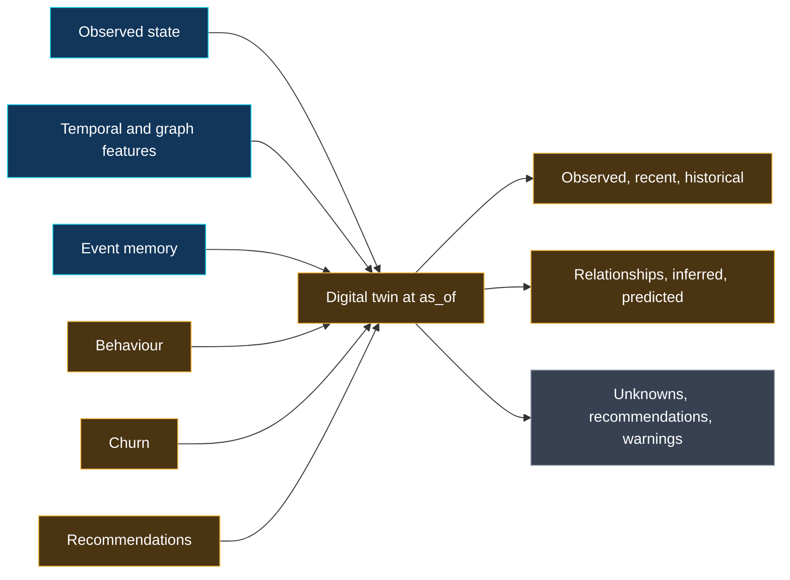

## Notebook and UI evidence

### Twin section coverage


### Predicted versus recommended sections

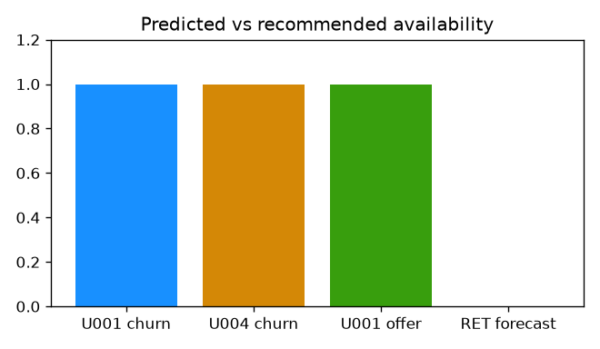

### Customer 360 twin experience

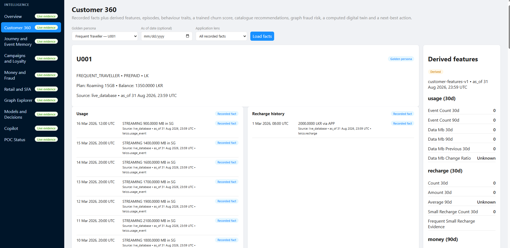

### Supporting artifacts

- [Digital-twin metrics](../../notebooks/09_digital_twins/outputs/metrics.json)
- [U001 customer twin](../../notebooks/09_digital_twins/outputs/tables/u001_twin.json)
- [Retailer twin](../../notebooks/09_digital_twins/outputs/tables/retailer_twin.json)
- [Section coverage data](../../notebooks/09_digital_twins/outputs/tables/section_coverage.json)

## Technical details to present

### Customer-twin sections

- Observed
- Recent
- Historical
- Relationships
- Inferred
- Predicted
- Unknown
- Recommended
- Warnings

### Customer composition

The customer twin combines:

- Observed customer state
- Temporal and graph features
- Retrieved historical episodes
- Behaviour traits
- Churn prediction
- Recommendations

### Retailer twin

The retailer twin provides:

- Observed facts
- Historical activity
- Predicted values where available
- Recommended actions where available

### Unknown-first design

Missing sections remain visible rather than receiving empty default values. Examples include:

- Neo4j graph unavailable
- Current trip duration unknown
- Previous feature window empty
- Capability not included in the current twin contract

### Evidence

- U001 primary offer: `ROAM_15`
- U001 traits: heavy data user, frequent traveller, streaming heavy
- U004 churn band: HIGH
- Relationship and time-window unknowns remain explicit

### Bounded composition

Graph fraud and SFA forecasting are live as separate panels. They are not silently injected into a twin contract that was defined to compose a smaller capability set.

## Strong interview statement

> “The twin is not a giant customer table. It is a computed, typed view that tells the consumer what is observed, inferred, predicted, recommended, or still unknown.”

---

# Slide 13 — Capability 10: decision engine and explanations

## Core message

Predictions inform decisions, but they do not directly become business actions.

## Explanation flowchart

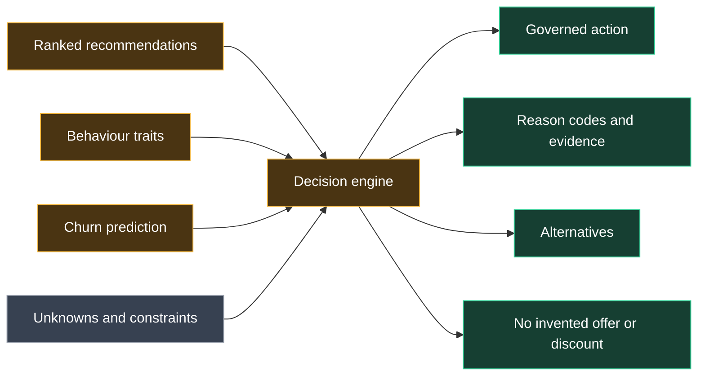

## Notebook and UI evidence

### Decision actions across seed personas


### Live next-best-action view

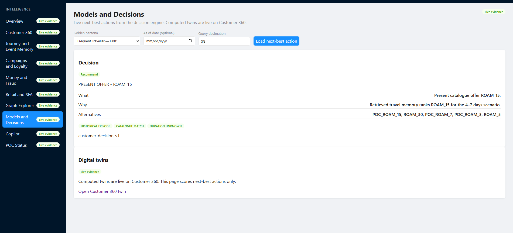

### Supporting artifacts

- [Decision metrics](../../notebooks/10_decisioning/outputs/metrics.json)
- [Persona decisions](../../notebooks/10_decisioning/outputs/tables/persona_decisions.json)
- [No-invented-discount proof](../../notebooks/10_decisioning/outputs/tables/u004_no_discount.json)

## Technical details to present

### Inputs

The current decision engine composes:

- Ranked recommendations
- Behaviour traits
- Churn prediction

### Supported actions

- `PRESENT_OFFER`
- `SUPPORT_FOLLOW_UP`
- `REQUEST_INFORMATION`
- `NO_INVENTED_OFFER`

### Governance behaviour

- High churn can block an upsell.
- High churn cannot create an arbitrary discount.
- A recommendation must refer to a real catalogue plan.
- Missing information can trigger a request for information.
- No valid candidate produces no invented offer.

### Evidence scenarios

- U001: present `ROAM_15`
- U004: support follow-up because churn risk blocks normal upsell behaviour
- U002: no invented offer

### Explanation structure

Every decision can expose:

- What action was selected
- Why it was selected
- Evidence and reason codes
- Confidence or uncertainty
- Unknown inputs
- Alternative actions or offers

### Prediction versus decision

```text
Prediction: what may happen?
Decision: what should the business do under rules and constraints?
```

### Current limitation

The engine composes a defined subset of capabilities. Graph fraud, forecasting, and twins remain separate outputs rather than being silently added to the decision logic.

## Strong interview statement

> “A 99% churn probability is not a business action. The decision engine interprets that prediction under catalogue, eligibility, uncertainty, and customer-support rules.”

---

# Slide 14 — Capability 11: grounded Copilot

## Core message

Copilot explains structured intelligence. It does not calculate risk, invent products, or execute business commands.

## Explanation flowchart

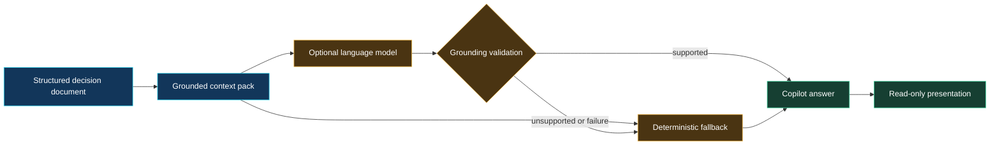

## Notebook and UI evidence

### Live grounded Copilot


### Supporting artifacts

- [Copilot metrics](../../notebooks/11_copilot/outputs/metrics.json)
- [Grounded deterministic fallback](../../notebooks/11_copilot/outputs/tables/u001_fallback.json)

The evidence confirms that the fallback names `ROAM_15`, explains that trip duration is unknown, and does not mention a fabricated plan.

## Technical details to present

### Context construction

The Copilot receives a structured decision document containing:

- Selected action
- Target plan when applicable
- Reason codes
- Historical evidence
- Alternatives
- Churn band
- Known and unknown information

### Two response paths

1. Deterministic fallback response
2. Optional external language-model response

The deterministic response is always available.

### Grounding validation

The system rejects responses that introduce unsupported content, such as:

- A plan outside the catalogue context
- An invented discount
- A destination not present in context
- A reason not supported by the decision document

### Provider-failure behaviour

If the external model is unavailable, misconfigured, or returns ungrounded text, the platform returns the deterministic fallback instead of failing the entire user experience.

### Evidence

- Notebook response source: deterministic fallback
- `ROAM_15` mentioned: true
- Unknown trip duration mentioned: true
- Fake plan mentioned: false

### Security boundary

- Provider keys remain in environment configuration.
- Keys are not placed in frontend files.
- Copilot is read-only.
- It does not have access to command execution.
- Conversation history is not implemented in the POC.

## Strong interview statement

> “The LLM is the last layer, not the intelligence engine. The facts, scores, recommendation, decision, and explanation already exist before the prompt is created.”

---

# Cross-capability technical themes

## Point-in-time correctness

The same `as_of` principle applies to:

- State reconstruction
- Temporal features
- Graph features
- Event memory
- Behaviour
- Churn
- Recommendations
- Fraud
- Forecasting
- Digital twins
- Decisions

This prevents future leakage and supports reproducibility.

## Explicit unknowns

The platform distinguishes:

- Observed zero
- Missing data
- Unavailable dependency
- Capability outside the current contract
- Information that is not yet known at `as_of`

This is especially important for graph availability, trip duration, previous feature windows, and uncomposed twin sections.

## Baseline-first modelling

The POC compares understandable baselines before adding complexity:

- Logistic regression versus gradient boosting for churn
- Naive and seasonal-naive forecasting before ARIMA and Prophet
- Deterministic fraud rules before graph ML
- Deterministic recommendation ranking before a learned ranker
- Deterministic Copilot fallback before optional LLM narration

## Versioning and provenance

Important derived contracts include a version and provenance:

- Dataset version
- Feature-set version
- Episode-set version
- Behaviour-set version
- Churn-model version
- Fraud-scorer version
- Forecast-model version
- Decision version
- Copilot context version

This makes debugging and comparison possible when logic evolves.

## Separation of responsibility

| Layer | Responsibility |
|---|---|
| Data layer | Authoritative facts and immutable history |
| Graph projection | Rebuildable relationship context |
| Feature layer | Reusable point-in-time derived inputs |
| Intelligence layer | Traits, predictions, recommendations, and risk |
| Twin layer | Composed contextual view |
| Decision layer | Governed action selection |
| Explanation layer | Evidence, alternatives, and uncertainty |
| Copilot layer | Natural-language presentation |

---

# Honest POC limitations

These points should be stated clearly rather than hidden:

- The dataset is synthetic and scenario-shaped.
- POC model metrics do not prove production accuracy or calibration.
- Thresholds and rules are demonstrative.
- Neo4j projection uses a controlled snapshot approach.
- Distributed projection workers and dead-letter handling are not implemented.
- Production authentication and tenant isolation are not implemented.
- Continuous model monitoring, drift, and fairness processes are not implemented.
- Recommendation and decision outcome feedback is not complete.
- Fraud review queues and transaction blocking are not implemented.
- The Copilot is read-only and has no conversation history.
- The interactive browser simulator is not implemented.

The correct positioning is:

> “The POC proves the architecture, contracts, scenarios, and evidence chain. Production readiness requires operational hardening and real outcome data.”

---

# Questions to prepare for

## Why PostgreSQL instead of putting everything in Neo4j?

PostgreSQL provides the authoritative transactions, ledgers, constraints, and historical event records. Neo4j is added for multi-hop relationship traversal. The systems have different responsibilities.

## Why is the graph rebuildable?

It prevents the graph from becoming a second source of truth and enables recovery, reconciliation, and replay from authoritative facts.

## How is future leakage prevented?

Every intelligence service accepts an explicit timezone-aware `as_of` and filters facts and episodes to information available at or before that time.

## Why not let the ML model choose the action directly?

A model score does not encode catalogue validity, policy, eligibility, uncertainty, customer-support rules, or alternatives. Those belong in a decision layer.

## Why use deterministic rules in several capabilities?

Rules create transparent baselines, are easy to validate, and demonstrate the evidence chain. They can later be compared with learned approaches without changing the platform contracts.

## What is the most valuable graph use case?

Graph fraud, because shared devices, wallet paths, merchant funnels, circular movement, and proximity to known fraud can reveal risk not visible in an isolated transaction.

## What would be the first production improvements?

1. Authentication and tenant isolation
2. Observability and projection-lag monitoring
3. Distributed outbox workers and dead-letter handling
4. Real outcome collection
5. Model calibration, drift, and fairness monitoring
6. Load and failure testing
7. Human review workflows for high-risk decisions

---

# Recommended closing

> “The main result is a reusable technical foundation. PostgreSQL preserves trusted facts and history, Neo4j adds relationship intelligence, point-in-time feature contracts support multiple capabilities, and a governed decision layer keeps predictions separate from business actions. The POC demonstrates the complete evidence chain while remaining honest about synthetic data and production gaps.”
