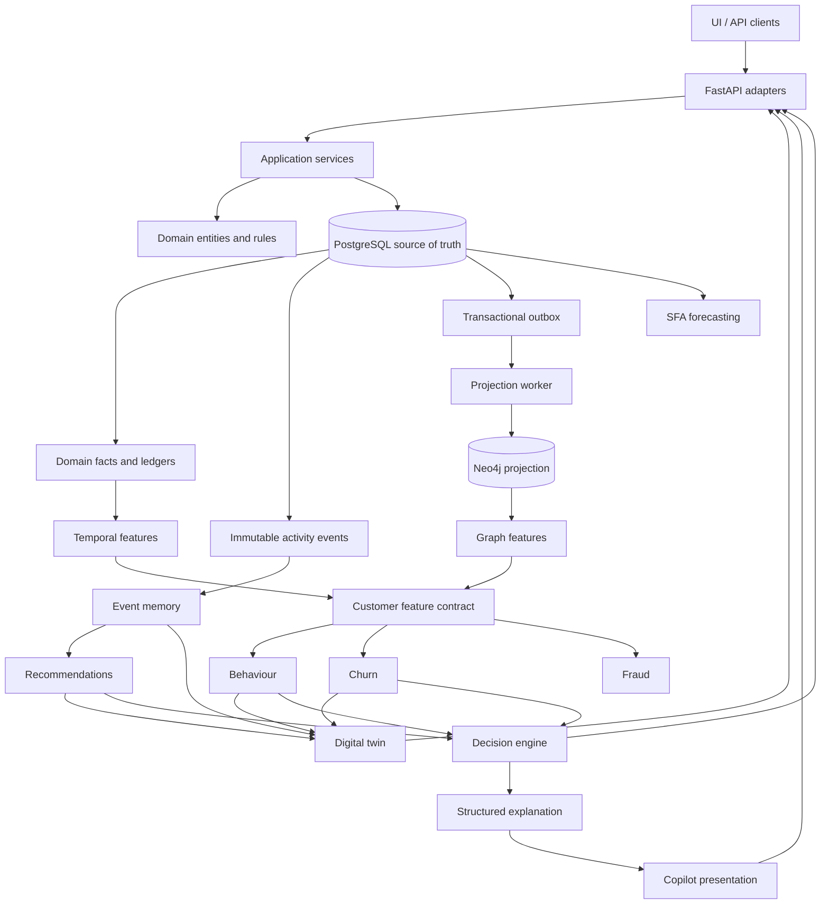
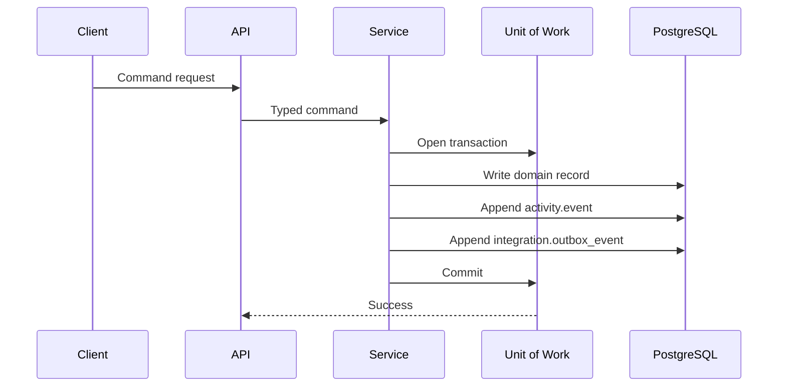

# Telco Digital Technical Study Guide

This guide explains the complete POC as a technical system: what was built, how data moves, why each architectural decision was made, where the implementation lives, and what limitations must be stated honestly in an interview.

## 1. The system in one answer

Telco Digital is a shared-intelligence POC built with FastAPI, SQLAlchemy 2.x, PostgreSQL, Neo4j, Pydantic, and selected ML tooling.

PostgreSQL is the source of truth. It stores business facts, ledgers, immutable activity events, transactional outbox events, and versioned intelligence outputs. Neo4j is a rebuildable projection used for relationship questions. Point-in-time services calculate temporal and graph features at an explicit `as_of`. Higher-level services use those features for event memory, behaviour traits, churn, recommendations, fraud, forecasting, digital twins, decisions, explanations, API responses, UI panels, and Copilot answers.

The most important design principle is:

> Facts, features, inferences, predictions, decisions, and explanations are different kinds of information and must not be mixed together.

## 2. Technology stack

| Area | Technology | Why it is used |
|---|---|---|
| Language | Python 3.12+ | Typed application and data services |
| HTTP API | FastAPI | Typed, asynchronous API adapters |
| Validation | Pydantic | Service and API contracts |
| ORM | SQLAlchemy 2.x async | Explicit PostgreSQL persistence |
| PostgreSQL driver | asyncpg | Asynchronous database access |
| Migrations | Alembic | Version-controlled relational schema |
| Relational database | PostgreSQL / Supabase-hosted PostgreSQL | Authoritative data and transactions |
| Graph database | Neo4j | Relationship projection and traversal |
| Graph driver | Neo4j Python Driver | Parameterized Cypher execution |
| ML notebooks | scikit-learn, pandas, statsmodels, Prophet | POC training and comparison |
| Testing | pytest and pytest-asyncio | Unit, integration, and scenario validation |
| Quality | Ruff, mypy, pre-commit | Static and style checks |
| Local infrastructure | Docker Compose | PostgreSQL and Neo4j development services |

Dependency definitions are in [`pyproject.toml`](../../pyproject.toml).

## 3. Locked architectural rules

These rules explain the design and should be memorized for interviews:

1. PostgreSQL is authoritative.
2. Neo4j is a rebuildable relationship projection.
3. Domain and application layers do not contain SQL or Cypher.
4. SQL stays in `infrastructure/postgres`.
5. Cypher stays in `infrastructure/neo4j`.
6. FastAPI routes are thin adapters and contain almost no business logic.
7. Every intelligence calculation is bounded by `as_of`.
8. Digital twins are computed views, not authoritative records.
9. Predictions do not directly execute business actions.
10. The Copilot presents structured intelligence; it does not create facts or predictions.

The primary references are [`LOCKED-ARCHITECTURE.md`](../LOCKED-ARCHITECTURE.md), [`DATA-MODEL.md`](../DATA-MODEL.md), and [`INTELLIGENCE.md`](../INTELLIGENCE.md).

## 4. End-to-end architecture



## 5. Codebase map

| Path | Responsibility |
|---|---|
| `src/telco_digital/domain` | Entities, enums, value objects, and deterministic business rules |
| `src/telco_digital/application/commands` | Typed command objects |
| `src/telco_digital/application/queries` | Typed queries and DTOs |
| `src/telco_digital/application/services` | Use cases and transaction orchestration |
| `src/telco_digital/application/unit_of_work` | Persistence abstraction used by application services |
| `src/telco_digital/infrastructure/postgres` | ORM models, sessions, repositories, SQL queries, and UoW implementation |
| `src/telco_digital/infrastructure/neo4j` | Projection, repository, Cypher mappings, graph features, and graph fraud queries |
| `src/telco_digital/infrastructure/workers` | Transactional outbox projection worker |
| `src/telco_digital/intelligence` | Features, memory, behaviour, churn, recommendations, fraud, forecasting, and twins |
| `src/telco_digital/decisioning` | Deterministic next-best-action rules and explanations |
| `src/telco_digital/copilot` | Grounded natural-language presentation with fallback |
| `src/telco_digital/api` | FastAPI application, dependencies, schemas, and routes |
| `alembic` | Database migrations |
| `scripts` | Database checks, seeding, feature materialization, projection, graph rebuild, and model tasks |
| `notebooks` | Executed capability evidence, metrics, plots, tables, and selected artifacts |
| `tests` | Unit, integration, and end-to-end scenario tests |

## 6. Data layer

### 6.1 Schema separation

The PostgreSQL model is separated by responsibility.

| Schema | Responsibility | Important records |
|---|---|---|
| `core` | Stable identity, account, and product data | customer, account, SIM, device, customer-device, plan, subscription |
| `telco` | Telecom activity | balance ledger, usage event, recharge, travel, service interaction |
| `marketing` | Engagement and loyalty | loyalty account, loyalty ledger, campaign, campaign interaction |
| `money` | Mobile money | wallet, merchant, transaction |
| `sfa` | Sales-force automation | distributor, retailer, agent, product, sales, inventory |
| `activity` | Cross-domain immutable history | universal business event |
| `integration` | Asynchronous integration | transactional outbox event |
| `intelligence` | Derived intelligence | feature snapshot, prediction, recommendation, outcome, warning |

### 6.2 Why ledgers are important

A mutable balance tells us the current value but cannot reliably explain the past. A ledger records every change.

For a time `T`:

```text
balance_at(T) = sum(ledger entries where occurred_at <= T)
```

This supports:

- Historical state reconstruction
- Auditing and correction
- Point-in-time feature calculation
- Replaying why an earlier decision was made

### 6.3 Facts versus derived data

| Information type | Example | Correct location |
|---|---|---|
| Fact | Customer used 1.8 GB | Domain tables and activity events |
| Derived feature | Usage rose 31% over the previous window | Feature service / feature snapshot |
| Inference | Heavy data user | Behaviour service |
| Prediction | Churn probability is 0.74 | Model prediction contract |
| Recommendation | ROAM_15 is ranked first | Recommendation service |
| Decision | Present ROAM_15 | Decision engine |
| Explanation | Prior similar trip and expected duration support it | Explanation contract |

Predictions and recommendations can change when the model, features, catalogue, or `as_of` changes. They must not overwrite facts.

### 6.4 Unit of Work

Application services depend on a `UnitOfWork` protocol, not directly on SQLAlchemy sessions. The SQLAlchemy implementation is [`unit_of_work.py`](../../src/telco_digital/infrastructure/postgres/unit_of_work.py).

The unit of work:

1. Creates an `AsyncSession` on entry.
2. Exposes repositories needed by application services.
3. Commits only when the use case succeeds.
4. Rolls back on failure.
5. Closes the session on exit.

Benefits:

- One transaction boundary per command
- Testable application services
- No hidden global session
- Consistent rollback behaviour

### 6.5 Transactional write path

Commands such as recharge, travel, usage, and plan purchase follow this pattern:



The three important changes are atomic:

1. Domain fact
2. Activity event
3. Outbox event

If any write fails, everything rolls back.

Relevant services include:

- [`recharge.py`](../../src/telco_digital/application/services/recharge.py)
- [`travel.py`](../../src/telco_digital/application/services/travel.py)
- [`usage.py`](../../src/telco_digital/application/services/usage.py)
- [`plan_purchase.py`](../../src/telco_digital/application/services/plan_purchase.py)
- [`common.py`](../../src/telco_digital/application/services/common.py)

### 6.6 Event-time semantics

The system distinguishes:

- `occurred_at`: when the activity happened in the real world
- `recorded_at`: when the platform received or persisted it
- `as_of`: the maximum event time an intelligence calculation may see

This distinction matters for delayed, corrected, or out-of-order events.

## 7. Capability 00 — Deterministic POC dataset

### Purpose

Create reproducible cross-domain data for telco, marketing, loyalty, money, service, and SFA scenarios.

### Flow

```text
Deterministic builder
→ DatasetBundle
→ one SQLAlchemy transaction
→ facts + activity events + outbox events
→ validation report
→ notebook analysis
```

### Important interfaces

- `build_dataset(background_customers=1000)`
- `load_dataset(engine, bundle)`
- `validate_dataset(engine, expected_counts)`
- `reset_dataset(engine, bundle)`
- `scripts/generate_poc_dataset.py`

### What to understand

- Golden customers demonstrate named scenarios.
- Background customers provide a wider synthetic population.
- Generation is deterministic so test and notebook results are reproducible.
- Material operations maintain parity between facts, activity events, and outbox events.
- Synthetic data demonstrates functionality, not real-world model accuracy.

Study [`00-poc-dataset.md`](../features/00-poc-dataset.md) and [`demo_dataset.py`](../../src/telco_digital/application/demo_dataset.py).

## 8. Capability 01 — Outbox and Neo4j projection

### Purpose

Build useful relationship context without making Neo4j authoritative.

### Projection flow

```text
PostgreSQL facts + pending outbox
→ locked worker batch
→ authoritative graph snapshot
→ Neo4j managed transaction
→ reconciliation
→ mark outbox processed only after success
```

### Important components

- `GraphSnapshot`: serializable authoritative graph input
- `GraphProjector.rebuild(...)`: orchestrates projection
- `GraphRepository`: only owner of Cypher mappings
- `process_batch(...)`: claims, projects, retries, and checkpoints
- `scripts/rebuild_graph.py`: explicit full rebuild
- `scripts/project_outbox.py`: process a projection batch

### Idempotency

Cypher uses parameterized `MERGE`, so replaying an event or snapshot does not create duplicate nodes or relationships.

### Managed reset

Projected nodes are marked with a projection identifier. Rebuild deletion is restricted to managed nodes so unrelated graph data is preserved.

### POC trade-off

The worker rebuilds an authoritative snapshot instead of applying efficient change-level Cypher for every event. This is simpler and safer for the POC but less scalable.

Study:

- [`projector.py`](../../src/telco_digital/infrastructure/neo4j/projector.py)
- [`repository.py`](../../src/telco_digital/infrastructure/neo4j/repository.py)
- [`outbox_worker.py`](../../src/telco_digital/infrastructure/workers/outbox_worker.py)
- [`01-neo4j-projection.md`](../features/01-neo4j-projection.md)

## 9. Capability 02 — Temporal and graph features

### Purpose

Create one reusable customer feature contract for a customer and point in time.

### Service design

```text
PostgreSQL facts
→ PostgresTemporalFeatureQueries
→ TemporalFeatureService

Neo4j projection
→ Neo4jFeatureQueries
→ GraphFeatureService

TemporalFeatureService + GraphFeatureService
→ CustomerFeatureService
→ CustomerFeatures
```

### Main API

```python
await customer_feature_service.calculate(customer_ref, as_of)
```

### Feature groups

- Usage
- Recharge
- Money
- Plan
- Travel
- Service
- Loyalty
- Campaign
- Graph relationship context

Temporal features include 30-day and 90-day windows and previous-window change. Graph features include degree, shared-device, counterparty, merchant, and transaction context bounded by `as_of`.

### Reproducibility

- Feature version: `customer-features-v1`
- Snapshot ID: deterministic UUID5 from customer ID, `as_of`, and version
- Materialization: explicit and idempotent
- Normal GET requests remain read-only

### Unknown handling

If Neo4j is unavailable, graph features are marked unavailable with provenance and reasons. They are not returned as false zeros.

Study:

- [`service.py`](../../src/telco_digital/intelligence/features/service.py)
- [`features.py`](../../src/telco_digital/infrastructure/postgres/features.py)
- [`features.py`](../../src/telco_digital/infrastructure/neo4j/features.py)
- [`materialize_features.py`](../../scripts/materialize_features.py)
- [`02-feature-layer.md`](../features/02-feature-layer.md)

## 10. Capability 03 — Event memory

### Purpose

Convert raw travel facts into episodes and retrieve relevant historical experience.

### Main contract

```python
await event_memory_service.recall(customer_ref, as_of, destination=None)
```

### Episode construction

A travel episode can include:

- Destination
- Start and effective end time
- Known or unknown duration
- Usage during the trip
- Plan active during the trip
- Outcome derived from available facts

Future `ended_at` values remain unknown when they occur after `as_of`.

### Retrieval priority

1. Same customer, same situation
2. Same customer, similar situation
3. Similar customers
4. Population history

This ordering prefers personal evidence before population assumptions.

### Current limitation

Memory is computed from facts rather than stored in a durable episode or vector database. Similarity is deterministic rather than learned.

Study [`event_memory/service.py`](../../src/telco_digital/intelligence/event_memory/service.py) and [`03-event-memory.md`](../features/03-event-memory.md).

## 11. Capability 04 — Behaviour intelligence

### Purpose

Derive reusable traits from temporal features and travel episodes while returning evidence and confidence.

### Flow

```text
CustomerFeatureService + EventMemoryService
→ BehaviourService.evaluate(customer_ref, as_of)
→ CustomerBehaviour + BehaviourTrait[]
```

### Design

- Served behaviour uses deterministic rules.
- Every trait includes confidence and evidence.
- Notebook clustering is used for analysis, not loaded into the API.
- No new SQL is introduced; the service consumes existing contracts.

### Why this separation matters

A behaviour trait is an inference, not a fact. It can be recomputed as thresholds or evidence change.

Study [`behaviour/service.py`](../../src/telco_digital/intelligence/behaviour/service.py) and [`04-behaviour-intelligence.md`](../features/04-behaviour-intelligence.md).

## 12. Capability 05 — Churn prediction

### Purpose

Return a point-in-time churn probability, risk band, drivers, model version, and feature snapshot.

### Training and serving split

```text
Customer features
→ notebook training
→ logistic regression vs gradient-boosted trees
→ exported coefficients and scaler parameters
→ lightweight runtime scoring
```

The runtime does not import scikit-learn. It applies the exported logistic-regression parameters directly.

### Output

- Probability
- Risk band
- Primary drivers
- Model version
- Feature snapshot
- `as_of`

### Important lesson

The stronger notebook model is not automatically the best production choice. The served logistic model is transparent, lightweight, versionable, and easier to explain.

### Limitation

Labels are synthetic and persona-shaped. Notebook hold-out metrics do not prove real-world calibration or accuracy.

Study:

- [`churn/service.py`](../../src/telco_digital/intelligence/churn/service.py)
- [`churn/model.py`](../../src/telco_digital/intelligence/churn/model.py)
- [`churn/features.py`](../../src/telco_digital/intelligence/churn/features.py)
- [`05-churn-prediction.md`](../features/05-churn-prediction.md)

## 13. Capability 06 — Recommendations and uncertainty

### Purpose

Turn a travel situation into ranked real catalogue offers without inventing products.

### Flow

```text
EventMemoryService + PlanRepositoryCatalogue
→ candidate generation
→ deterministic scoring
→ uncertainty assessment
→ decision mode
→ ranked recommendation
```

### Decision modes

- `SINGLE_RECOMMENDATION`
- `RANKED_OPTIONS`
- `SCENARIO_BASED`
- `ASK_FOR_INFORMATION`
- `NO_RECOMMENDATION`

### Uncertainty model

Facts are classified as known, inferred, predicted, or unknown. For example, an unknown trip duration can cause a scenario-based response instead of false precision.

### Critical safety rule

Candidates come only from the plan repository. There is no free-form `model → SKU` mapping.

Study:

- [`recommendations/service.py`](../../src/telco_digital/intelligence/recommendations/service.py)
- [`recommendations/catalogue.py`](../../src/telco_digital/intelligence/recommendations/catalogue.py)
- [`06-recommendations-uncertainty.md`](../features/06-recommendations-uncertainty.md)

## 14. Capability 07 — Graph fraud

### Purpose

Show that relational transaction risk and relationship risk can produce different evidence and different scores.

### Flow

```text
PostgreSQL money activity → TransactionRiskFeatures
Neo4j relationships → GraphFraudFeatures
both feature sets → deterministic rules → scorer → CustomerFraud
```

### Implemented rules

- `SHARED_DEVICE`
- `KNOWN_FRAUD_WITHIN_2_HOPS`
- `WALLET_FUNNEL`
- `CIRCULAR_TRANSFERS`
- `ABNORMAL_CREATION`
- `ABNORMAL_TRANSACTION_VELOCITY`

Known-fraud distance uses wallet and transfer hops. Device sharing is evaluated separately so a shared device is not incorrectly treated as a wallet-based two-hop path.

### Scoring

The output preserves:

- Transaction-only risk
- Graph-only risk when available
- Combined risk
- Fired deterministic rules
- Drivers and unknowns

If graph evidence is unavailable, graph risk remains unknown instead of becoming zero.

### Why graph adds value

A relational transaction may look normal in isolation. A graph can reveal that the customer shares a device with another identity, routes funds through a merchant funnel, participates in circular movement, or is close to a known fraud entity.

### Limitation

This POC does not block transactions or create a review queue. Graph ML embeddings are not served.

Study:

- [`fraud/service.py`](../../src/telco_digital/intelligence/fraud/service.py)
- [`fraud/rules.py`](../../src/telco_digital/intelligence/fraud/rules.py)
- [`fraud/scorer.py`](../../src/telco_digital/intelligence/fraud/scorer.py)
- [`neo4j/fraud.py`](../../src/telco_digital/infrastructure/neo4j/fraud.py)
- [`07-graph-fraud.md`](../features/07-graph-fraud.md)

## 15. Capability 08 — SFA forecasting

### Purpose

Forecast retailer demand from SFA facts and convert the forecast into stockout risk and a proposed restock action.

### Model comparison

- Naive
- Seasonal naive
- Moving average
- ARIMA/SARIMAX
- Prophet

Training stays in notebooks. The winning artifact is reconstructed by lightweight runtime code without importing Prophet or statsmodels into the API.

### Runtime output

- Versioned daily demand history
- Seven-day product forecast
- Inventory cover days
- Stockout probability
- Risk band
- `RESTOCK`, `MONITOR`, or `HOLD`

### Important distinction

Forecasting predicts demand and risk. The action is a separate rule-based interpretation of that forecast.

### Limitation

The POC expands monthly pulses into daily demand. Supplier lead time and promotion effects may be unknown. Synthetic hold-out MAPE is not proof of production accuracy.

Study:

- [`forecasting/service.py`](../../src/telco_digital/intelligence/forecasting/service.py)
- [`forecasting/series.py`](../../src/telco_digital/intelligence/forecasting/series.py)
- [`forecasting/models.py`](../../src/telco_digital/intelligence/forecasting/models.py)
- [`08-sfa-forecasting.md`](../features/08-sfa-forecasting.md)

## 16. Capability 09 — Digital twins

### Purpose

Build a computed point-in-time view that assembles facts and intelligence without becoming another source of truth.

### Customer twin sections

- Observed
- Recent
- Historical
- Relationships
- Inferred
- Predicted
- Unknown
- Recommended
- Warnings

### Retailer twin sections

- Observed
- Historical
- Predicted
- Recommended

### Composition

```text
Observed state
+ CustomerFeatureService
+ EventMemoryService
+ BehaviourService
+ ChurnService
+ RecommendationService
→ DigitalTwinService.build(entity_id, as_of)
```

### Important limitation

The customer twin deliberately composes a bounded capability set. Graph fraud and SFA forecasts remain separate live panels where they are not part of the twin contract. Unknown sections make missing composition explicit.

Study [`digital_twin/service.py`](../../src/telco_digital/intelligence/digital_twin/service.py) and [`09-digital-twins.md`](../features/09-digital-twins.md).

## 17. Capability 10 — Decision engine and explanations

### Purpose

Convert ranked offers, behaviour, and churn into a governed next-best action.

### Inputs

- `RecommendationService`
- `BehaviourService`
- `ChurnService`

### Actions

- `PRESENT_OFFER`
- `SUPPORT_FOLLOW_UP`
- `REQUEST_INFORMATION`
- `NO_INVENTED_OFFER`

### Governance rule

A high churn probability may block an upsell or trigger support follow-up, but it cannot invent a discount or SKU.

### Explanation structure

- What was selected
- Why it was selected
- Evidence and reason codes
- Confidence or uncertainty
- Unknowns
- Alternatives

### Key distinction

```text
Prediction: what is likely to happen?
Decision: what should the business do under rules and constraints?
```

Study [`decisioning/service.py`](../../src/telco_digital/decisioning/service.py) and [`10-decision-engine.md`](../features/10-decision-engine.md).

## 18. Capability 11 — Copilot

### Purpose

Present structured decision intelligence in natural language without allowing the LLM to create unsupported facts, products, or discounts.

### Flow

```text
DecisionEngine
→ structured context pack
→ deterministic fallback or optional OpenRouter call
→ grounding validation
→ CopilotAnswer
```

### Safety behaviour

- A deterministic fallback is always available.
- Only catalogue plans contained in context may be named.
- Unsupported or ungrounded model text is rejected.
- Provider failure returns the fallback.
- API keys remain environment-only and never enter frontend code.

### Limitation

There is no conversation history or autonomous command execution. Copilot is a read-only presentation layer.

Study [`copilot/service.py`](../../src/telco_digital/copilot/service.py) and [`11-copilot.md`](../features/11-copilot.md).

## 19. Capability 12 — FastAPI

### Purpose

Expose stable application and intelligence services through thin HTTP adapters.

### Command routes

- `POST /api/v1/commands/recharge`
- `POST /api/v1/commands/travel`
- `POST /api/v1/commands/travel/end`
- `POST /api/v1/commands/plan-purchase`
- `POST /api/v1/commands/usage`

### Customer query routes

- `GET /api/v1/customers/{ref}/state`
- `GET /api/v1/customers/{ref}/timeline`
- `GET /api/v1/customers/{ref}/features`
- `GET /api/v1/customers/{ref}/event-memory`
- `GET /api/v1/customers/{ref}/behaviour`
- `GET /api/v1/customers/{ref}/churn`
- `GET /api/v1/customers/{ref}/fraud`
- `GET /api/v1/customers/{ref}/twin`
- `GET /api/v1/customers/{ref}/recommendations`
- `GET /api/v1/customers/{ref}/decision`
- `GET /api/v1/customers/{ref}/360`
- `GET /api/v1/customers/{ref}/intelligence`

### Other important routes

- Retailer forecast and twin
- Graph summary and customer graph context
- Showcase overview, evidence, personas, status, and walkthroughs
- Health, readiness, projection lag, and model catalogue
- Copilot question endpoint

### Route rule

Routes validate input, resolve dependencies, call services, and translate errors. They do not contain SQL, Cypher, model scoring, or domain rules.

Study:

- [`api/app.py`](../../src/telco_digital/api/app.py)
- [`api/deps.py`](../../src/telco_digital/api/deps.py)
- [`api/routes`](../../src/telco_digital/api/routes)
- [`12-fastapi.md`](../features/12-fastapi.md)

## 20. Read-only showcase UI

The UI exposes implemented intelligence without becoming another business-logic layer.

Main views include:

- Intelligence overview
- Customer 360
- Journey and recommendation evidence
- Graph Explorer
- Money and fraud risk
- Retail and SFA forecasting
- Digital twins
- Decision and model panels
- Capability status
- Copilot

The UI must distinguish:

- PostgreSQL facts
- Neo4j relationships
- Derived features
- Predictions
- Recommendations and decisions
- Unknown or unavailable data

Capability 13, the interactive simulator, remains not started. Command APIs exist, but a complete browser simulation workflow must not be claimed as delivered.

## 21. Configuration and database operation

### Important environment concepts

- `DATABASE_URL` must be a PostgreSQL SQLAlchemy URL such as `postgresql+asyncpg://...`.
- A Supabase project URL or API key is not a database connection string.
- Neo4j connection settings are separate because Neo4j is not hosted inside PostgreSQL.
- Provider and database secrets belong only in environment configuration.
- Never include `.env` values in documents, code, screenshots, or commits.

### Setup commands

```powershell
python -m poetry install --extras "dev api ml notebooks"
python -m poetry run alembic upgrade head
python -m poetry run alembic current
python -m poetry run python scripts/check_postgres_connection.py
python -m poetry run python scripts/seed_demo_data.py
```

### Projection and feature commands

```powershell
python -m poetry run python scripts/rebuild_graph.py
python -m poetry run python scripts/project_outbox.py
python -m poetry run python scripts/materialize_features.py
```

Check each script's current CLI help before adding parameters.

### API command

```powershell
python -m poetry run uvicorn telco_digital.api.app:app --reload
```

## 22. Testing strategy

The repository currently contains unit, integration, and scenario test layers.

### Unit tests

Validate pure business rules, scoring, service composition, API adapter behaviour, and edge cases without requiring live infrastructure.

Examples:

- Travel and recharge warnings
- Feature composition
- Recommendation uncertainty
- Fraud rules
- Forecast scoring
- Digital twin assembly
- Decision behaviour
- Copilot grounding

### Integration tests

Validate real PostgreSQL and Neo4j behaviour, projection, live features, and end-to-end service wiring.

### Scenario tests

Validate important business stories such as:

- Impossible travel
- Historical reconstruction
- Frequent small recharge pattern
- Travel recommendation
- Graph fraud
- Churn and behaviour
- Retailer stockout
- Digital twin and decision flow

### Current tree

A source scan identifies 173 test functions: 134 unit, 17 integration, and 22 scenario tests. This is a count of test definitions, not a claim that they were all executed in this documentation turn.

### Useful commands

```powershell
python -m poetry run pytest
python -m poetry run pytest tests/unit -q
python -m poetry run pytest tests/integration -q
python -m poetry run pytest tests/scenarios -q
python -m poetry run pytest tests/scenarios/test_impossible_travel.py -q
python -m poetry run ruff check src tests scripts
python -m poetry run mypy src
```

## 23. Notebook evidence

Notebooks are used for capability evidence and model comparison, not as the production application runtime.

| Notebook area | Evidence |
|---|---|
| `00_dataset` | Dataset distributions and row counts |
| `01_graph_projection` | Reconciliation, graph counts, shared devices |
| `02_features` | Temporal windows, missingness, graph distributions, leakage checks |
| `03_event_memory` | Episode extraction and match priority |
| `04_behaviour` | Trait counts and cluster comparison |
| `05_churn` | Model comparison, coefficients, risk bands |
| `06_recommendations` | Candidate scores and uncertainty modes |
| `07_graph_fraud` | Transaction versus graph risk and rule firings |
| `08_sfa_forecasting` | Forecast comparison, demand, and stockout cover |
| `09_digital_twins` | Section coverage and twin examples |
| `10_decisioning` | Decision actions and no-invented-discount proof |
| `11_copilot` | Grounded fallback response |
| `12_fastapi` | Route surface and model catalogue |

## 24. Important failure lessons

### Parent-child flush ordering

If SQLAlchemy tries to insert an account before its customer row is visible, a foreign-key violation can occur. Explicitly flush parent aggregate roots before dependent records where ordering is important.

### Transient hosted-database failures

A connection disappearance or timeout may be a provider/network issue. Rerun a focused live check before changing correct application logic.

### Alembic URL percent signs

Alembic uses ConfigParser semantics. Percent signs in a database URL must be escaped only at the configuration boundary, not throughout application configuration.

### Timezone-naive timestamps

Intelligence services reject timezone-naive `as_of` values. Point-in-time comparison is unsafe without explicit timezone awareness.

### Jupyter event loop

Inside notebooks, use top-level `await`. Calling `asyncio.run()` inside Jupyter fails because a loop is already running.

### Missing graph data

Unavailable graph context is not the same as an observed count of zero. Preserve availability, provenance, and unknown reasons.

### Pytest module-name collisions

Unit and integration modules should have distinct basenames where import mismatch is possible.

## 25. POC versus production

### Demonstrated by the POC

- Architectural separation
- Point-in-time correctness
- Reproducible synthetic scenarios
- Rebuildable relationship projection
- Typed service contracts
- Explainable rules and selected model artifacts
- API and UI integration
- Automated test coverage across layers

### Still needed for production

- Authentication and authorization
- Multi-tenant isolation
- Secret rotation and operational policies
- High availability and disaster recovery
- Distributed outbox workers and dead-letter handling
- Projection-lag monitoring and alerting
- Large-volume load and performance testing
- Model registry, monitoring, calibration, drift, and fairness processes
- Production training data and outcome feedback
- Recommendation outcome recording
- Human fraud review workflows
- Complete observability and SLAs
- Interactive UI simulator

## 26. Interview questions and model answers

### Why use both PostgreSQL and Neo4j?

PostgreSQL provides transactions, authoritative facts, ledgers, and temporal reconstruction. Neo4j provides efficient multi-hop relationship traversal. Using the transactional outbox keeps them consistent without making the graph authoritative.

### Why not write directly to both databases?

A dual write can partially succeed. The domain write may commit while the graph write fails. Writing an outbox event in the same PostgreSQL transaction makes projection retryable and recoverable.

### Why is `as_of` required everywhere?

It prevents future leakage and makes historical features, predictions, recommendations, and twins reproducible.

### Why are digital twins computed?

A twin combines facts and changing intelligence. Persisting it as the source of truth would duplicate authority and become stale. It is computed from versioned inputs at a selected time.

### Why separate predictions and decisions?

A probability does not encode eligibility, policy, uncertainty, or business constraints. The decision engine applies those rules and can explain alternatives.

### How do you handle Neo4j being unavailable?

The authoritative PostgreSQL path continues to exist. Graph features explicitly report unavailable context, and Neo4j can be rebuilt from PostgreSQL. The system must not convert unavailable evidence to zero.

### Why serve logistic regression instead of the most complex churn model?

The served model is small, transparent, versionable, easy to reconstruct without a heavy runtime, and suitable for demonstrating auditable scoring. Notebook comparison still records the trade-off with stronger models.

### What is the best graph use case in this POC?

Fraud. Shared devices, wallet paths, merchant funnels, circular transfers, and distance to known fraud are naturally relationship questions and can reveal risk that transaction-only features miss.

### What would you improve first for production?

Add identity and tenant controls, operational monitoring, distributed outbox handling, outcome collection, real training data, model governance, and load testing before expanding model complexity.

## 27. Suggested study sequence

### Session 1 — Architecture and data

- Read locked architecture and data model.
- Explain fact versus feature versus prediction versus decision.
- Draw the PostgreSQL, outbox, and Neo4j flow from memory.

### Session 2 — Commands and temporal correctness

- Trace recharge or plan purchase from API to UoW repositories.
- Study activity events and outbox creation.
- Explain `occurred_at`, `recorded_at`, and `as_of`.

### Session 3 — Graph and features

- Trace graph rebuild and outbox processing.
- Review Cypher ownership and idempotency.
- Trace `CustomerFeatureService.calculate` through both adapters.

### Session 4 — Memory and models

- Review episode extraction and match ranking.
- Compare behaviour inference with churn prediction.
- Explain notebook training versus runtime artifact scoring.

### Session 5 — Actions and governance

- Trace candidate generation and uncertainty.
- Study graph fraud rules and score composition.
- Explain digital twin composition and decision rules.

### Session 6 — Delivery and proof

- Review FastAPI routes and dependency construction.
- Walk through the UI evidence.
- Run selected unit and scenario tests.
- Practise explaining POC limitations without underselling the architecture.

## 28. Final checklist

You should be able to explain, without notes:

- Why PostgreSQL is authoritative
- Why Neo4j is rebuildable
- How the transactional outbox prevents dual-write inconsistency
- How historical state is reconstructed
- How `as_of` prevents leakage
- How feature snapshots are versioned and reproduced
- How event memory prioritizes personal history
- How behaviour differs from churn
- How graph fraud differs from transaction-only fraud
- Why recommendations cannot invent products
- Why forecasts do not directly execute actions
- Why twins are computed
- Why predictions and decisions are separate
- Why Copilot is only a presentation layer
- What is POC complete and what is still missing for production
